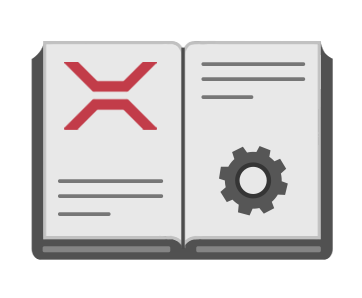

# Xenko documentation
<ul class="documentation_list col-md-8 col-sm-12">
	<li>
		

			
		

		<a href="manual/index.html">
			<h2>
				Manual
			</h2>
			

			

				Learn how to build projects and complete tasks in Xenko, including step-by-step tutorials
			

		</a>
	</li>
	<li>
		

			
		

		<a href="api/SiliconStudio.Xenko.Engine.yml">
			<h2>
				API 
			</h2>
			

			

				Xenko's API, with methods, properties, and other relevant information
			

		</a>
	</li>
	<li>
		

			
		

		<a href="ReleaseNotes/index.html">
			<h2>
				Release notes
			</h2>
			

			

				What's in the latest version of Xenko (and older versions too)
			

		</a>
	</li>
</ul>