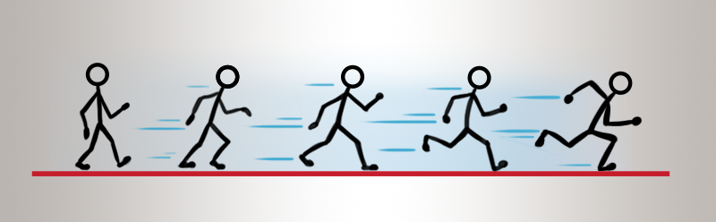

# 2D animations
Intermediate
Programmer
Designer

2D applications are made of **sprites**. Sprites power up UI, control gameplay, and animate your game characters.

Yet, loading individual images is inefficient, that's why 2D games traditionally use **Sprite Sheets**.

Sprite Sheets combine multiple images in a single file.

Then you can use **Scripts** to render Sprites from the Sprite Sheets in a particular order.

You can also use **Sprite Sheets** to render UI elements of your applications.

## See also

* [Import sprite sheets](import-sprite-sheets.md)
* [Edit sprites](edit-sprites.md)
* [Use 2D animations](use-2d-animation.md)
