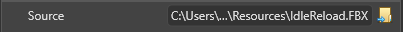
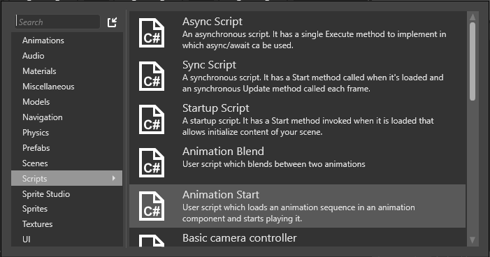

# Additive animations
Intermediate
Designer

**Additive animation clips**, also known as **difference clips**, let you **add** the same animation to different base animations.

In the example above, the leftmost animation is the walking animation. The rightmost animation is the idle animation. The two animations in the middle are walking and idle respectively, but have the reload animation added to them. Instead of creating different reload motions, we can create a single reloading animation additive clip and apply it to the walking and idle animations.

Let's say you want to create an additive animation, **ReloadAdditive**, which makes the character reload her weapon. You want to apply this animation to many different base animations, such as *Idle*, *Walk*, *Run*, *Crouch* and so on. 

To do this, create a difference clip, which adds the difference between your **target** (the pose you want to display) and your **base** (the pose you start from). If you apply this difference clip to another base animation, you get animation similar to the target pose, but adjusted for the new base pose.

In the example above, we created the difference clip by creating two animations, *Idle* and *IdleReload*, and rebasing the reload motion on the idle motion by removing the matching motions and only keeping the unique ones. The result is an animation which only contains the motion for reloading the weapon. If we apply it on top of _Idle_ we get the _IdleReload_ motion, because these two clips were used to create the difference clip. If we apply it to _Walk_ however we get a new result where the character walks and reloads her weapon at the same time. 

Not any base animation can be combined with any additive animation, but if the base motions are similar enough, the result is good.

## Set up additive animations

You can create a difference clip in the following way:

1. Create an **Animation** asset and add the **Source** (for example, _IdleReload_). If you play this animation out your character will stand and reload her weapon.

    

2. In **Type** choose **Difference Clip**. Expand the settings and you will find **Reference** where you can add your base clip. The _difference clip_ will be created by referencing _against_ the base clip, effectively resulting in _difference = source - base_. In the example above our base is the _Idle_ animation.

    

3. Under **Difference Clip** you can also choose **Mode**. **Animation** will play out the base animation, referencing it frame by frame. **First Frame** will create the difference clip by only referencing the first frame from the base animation as a still pose. If you only need the base pose as a reference, set this attribute to **First Frame**.

4. Set up a skeleton apprppriate for both the original animations which you used and your model.

    

5. If you want to preview the animation clip in the editor, set Preview model suitable for the animation.

    

## Apply additive animations to your model

Now, you can use additive animation with the another motion that uses the same skeleton and skinned mesh:

1. In **Asset View** right click to create a new asset and add **Scripts -> Animation Start**. AnimationStart is a Startup script which you can use to load a list of playing animations into your model. Recompile your project to apply the changes and make the script available.

    

2. In **Scene view**, select the desired entity. 

    

3. In **Property grid**, click _Add animation component_ and choose **Animations**. You need animation component on your entity in order to animate it.

    

4. Still on the selected entity, add another new component and choose the newly added script _Animation Start_. You will notice there is a list of animations which will be loaded into your entity. Add at least two since additive animations can't be played alone. Select the default animation for your character with **Linear Blend** and then add a second animation with **Add** for blending animation. For the clip of the second animation choose the difference clip you created earlier.

    
    
## See also

* [3D animations overview page](import-animation-assets.md)
* [Import animation assets](use-animations.md)
* [Set up animation assets](import-animations.md)
* [Procedural animations](procedural-animation.md)

