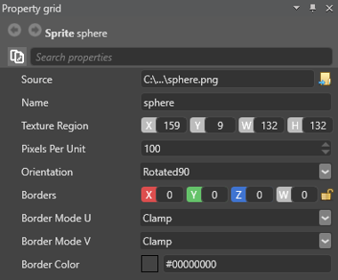

# Edit sprites
Beginner
Designer

Once you import a **Sprite Sheet**, you can use it to create 2D Animations.
Xenko's dedicated **Sprite Editor** is designed specifically for 2D Animations.
In **Asset View**, double-click **Sprite Sheet** to open it in the **Sprite Editor**.

**Sprite Editor** lets you extract Sprites from the **Sprite Sheets**.
This way you can have many images of the 2D animation in a single file, or even combine multiple **Animations** in a single **Sprite sheet**.

Keep in mind you can adjust general Sprite Properties in **Property Grid** on the right-hand side of **Sprite Editor**.
Here you can change the following **Sprite Sheet Properties**:

* Set Sprite Sheet _Parameters_.
* Set Sprite Sheet _Packing_ options.

After you set up the general properties, you can manage separate frames of your **2D Animation**.

## Manage frames
On the left-hand side of the **Sprite Editor**, you can manage individual sprites (frames) of the 2D Animation:

1. Choose sprite sheet type: **Sprite2D** or **UI**.
2. Manage sprites:
    * Add empty sprite entities.
    * Duplicate or delete frames.
    * Change frame order by moving selected frames up or down the order.

    

Each sprite has an index. Top **Sprite** has index **[0]**, second has index **[1]** and so on.
You can use this index in **Scripts** to get individual **Sprites** of the Sprite Sheet.

## Select sprites from sprite sheet
You can adjust sprite borders by selecting required sprite sheet region.
There are three ways to set sprite borders:

**Option 1**: Drag the borders manually, like you do with the common selection tools of the image-processing software:

    <video autoplay loop class="responsive-video" poster="media\2d-animations-select-sprite-borders.jpg">
       <source src="media\2d-animations-select-sprite-borders.mp4" type="video/mp4">
    </video>

**Option 2**: In **Property Grid**, set the _Texture Region Properties_: position along _X_ and _Y_ axes, _width_ and _height_ (in pixels):

**Option 3**: Activate **Magic Wand** tool and click on the sprite you want to be in the current frame.

> [!Tip]
> You can activate Magic Wand with an **M** hotkey.

Magic Wand identifies sprites using _Transparency_ or _Color Key_:

* _Transparency_: **Magic Wand** treats the edges of the non-transparent regions as sprite borders.
* _Color Key_: select **Color Key** with a color picker tool at the left-hand side of the editor.
**Magic Wand** identifies sprite borders using this **Color Key**.

### Zoom and scale view

There are other _Tools_ that help you manage your **Sprite Sheets**:

* Switch to _Previous_ or _Next_ frame.
* _Zoom_ and _Scale_ image.
* _Highlight_ currently selected sprite sheet region.
* _Use the whole sprite sheet_ for this sprite.
* _Move the center_ of the sprite.

## Adjust sprite properties

In **Property Grid**, you can set properties of the individual frames:

1. Change _Source File_ of a particular frame.
2. Change _Name_ of the frame.
3. Set _Texture Region_, as described in [Select Sprites from Sprite Sheet](#select-sprites-from-sprite-sheet).
4. Set _Pixels per Unit_.
5. Set orientation of the **Sprite**.
6. Manage _Borders_ of the frame.

## See also

* [Import sprite sheets](import-sprite-sheets.md)
* [Use 2D animations](use-2d-animation.md)