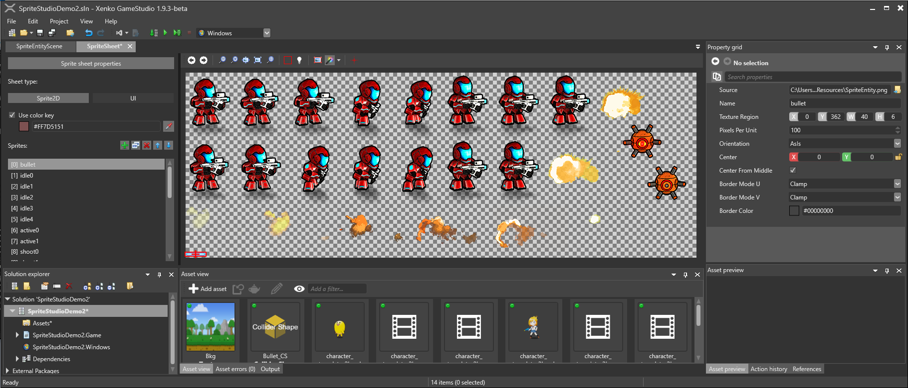

# Edit sprites

Beginner
Designer

After you [import a sprite sheet](import-sprite-sheets), you can use the dedicated **Sprite Editor** to define and edit sprites within the sprite sheet.

You can also edit sprite properties in the **property grid** like any other asset.

## Open the Sprite Editor

To open the Sprite Editor, in the **asset view**, double-click the sprite sheet asset. 

The asset opens in the Sprite Editor.

### Set **Sprite2D** or **UI** mode

You can set whether the sprite sheet contains gameplay sprites (**Sprite2D**) or UI sprites (**UI**). These let you set slightly different properties, described under **Properties** below.

### Add a sprite

To add a sprite, click the **Add empty sprite** button.

>[!Note]
>When you add a new sprite, it has no associated sprite sheet file. You need to specify one in the **property grid**.

>[!Tip]
>If you want to create a new sprite from the same sprite sheet, it's often faster to duplicate an existing sprite and work from that. To duplicate a sprite, select the sprite and click **Duplicate selected sprites**, or press **Ctrl + D**.
>
>

### Manage sprites

The Sprite Editor lists the sprites in your project on the left. Each sprite has an index number; the first has the index *[0]*, second has index *[1]*, and so on. You can use these indexes in your scripts (see [Use 2D animations](use-2D-animations.md)).

To change the order (and index number) of sprites, use the  (**Move selected sprite up/down**) buttons. For example, if you move *[1]Sprite* down, it becomes *[2]Sprite*.

#### Define a color for transparency

By default, at runtime, Xenko treats transparent areas of the sprite sheet as transparent. Alternatively, you can set a key color to be transparent instead. To do this, select **Use color key** and define a color. For example, if you set absolute black (#FF000000), areas of absolute black will be transparent at runtime.

### Set sprite borders

You create sprites by defining borders in the sprite sheet. There are three ways to do this: by using the Magic Wand tool, by setting the borders manually, or by specifying the pixel coordinates.

#### Use the Magic Wand

The **Magic Wand** selects sprite borders automatically. This is usually the fastest way to select sprites.

To select or deselect the Magic Wand, click the icon in the Sprite Editor toolbar, or press the **M** key.

To choose how the Magic Wand identifies sprite borders, use the **drop-down list** in the toolbar.

* **Transparency**: The Magic Wand treats the edges of the non-transparent regions as sprite borders. For example, if the sprite is surrounded by transparent space, it sets the border at the edge of the transparent space.

* **Color key**: The Magic Wand identifies sprite borders using the color set under **Color key** in the Sprite Editor. For example, if the sprite is surrounded by absolute black, and you set absolute black as the color key, the Magic Wand sets the border at the edge of the absolute black space.

#### Set borders manually

You can drag the borders and reposition the border area manually.

    <video autoplay loop class="responsive-video" poster="media\2d-animations-select-sprite-borders.jpg">
       <source src="media\2d-animations-select-sprite-borders.mp4" type="video/mp4">
    </video>

#### Set the borders in the property grid

You can define the XYWH pixel coordinates of the sprite borders in **property grid** under **Texture Region**.

#### Sprite Editor toolbar

* Move to the previous or next frame in the list
* Zoom out and in
* Show the "actual size" of the image (real pixel size)
* Fit the sprite sheet to your screen
* Highlight the currently selected sprite sheet region
* Center the view on the currently selected sprite
* Change the color of the border selection
* Highlight the current selection
* Move the sprite center (Sprite2D mode only)
* Resize the sprite borders (UI mode only)
* Lock the sprite borders (UI mode only)

## Sprite properties

You can also set the properties of individual sprites in the **property grid**.

### Source

The sprite sheet image this sprite is taken from.

### Name

The name of this sprite. You can also edit this by double-clicking a sprite in the sprite list in the Sprite Editor.

### Texture region

The region of the sprite sheet used for this sprite.

### Pixels per unit

The region of the sprite sheet used for this sprite.

### Center

>[!Note]
>This property is only available if the sprite sheet is set to **Sprite2D** on the left.

Set the coordinates of the center of the sprite. By default, the center is **0, 0**.

#### Center from middle

### Borders
>[!Note]
>This property is only available if the sprite sheet is set to **UI** on the left.

#### Border Mode U

#### Border Mode U

## See also

* [Import sprite sheets](import-sprite-sheets.md)
* [Use 2D animations](use-2d-animation.md)