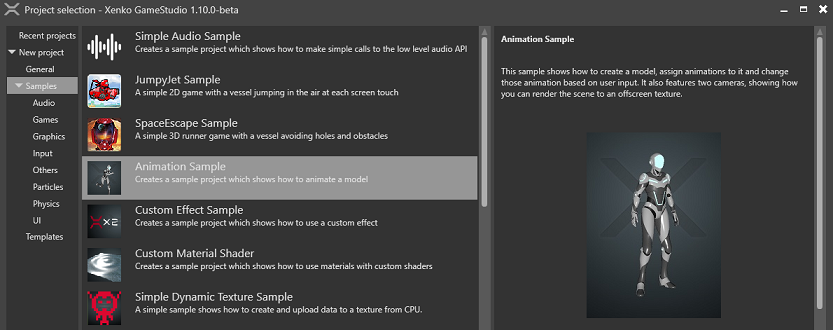

# Animation

Xenko lets you animate 3D models by adding skeletons, skinned meshes, and animations.

For information about 2D animation, see [Sprites](../sprites.md).

## Animation sample

For an example of how animations work in Xenko, load the **Animation** sample project.

 

## In this section

* [3D animation](animation.md)
    * [Import animation assets](import-mesh-and-skeleton.md)
    * [Setup animation assets](import-animations.md)
      * [Additive animation](additive-animation.md)
      * [Procedural animation](procedural-animation.md)
    * [Use animation assets](set-up-animations.md)
      * [Code sample](use-animations.md)
      * [Custom blend trees](custom-blending-trees.md)