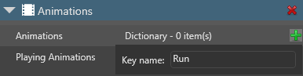
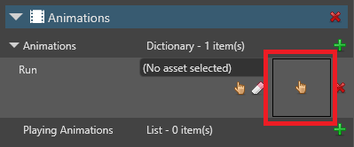

# Set up animations

<span class="label label-doc-level">Beginner</span>
<span class="label label-doc-audience">Designer</span>
<span class="label label-doc-audience">Programmer</span>

To set up animations for a 3D model:

1. Add an [AnimationComponent](xref:SiliconStudio.Xenko.Animations.AnimationComponent) to an entity.

2. Add animations to the [AnimationComponent](xref:SiliconStudio.Xenko.Animations.AnimationComponent).

3. Create scripts to animate your models at runtime.

## 1. Add animations to an entity

To use animations in the script, first add them to the entity in Game Studio.

To display an animated model, the entity needs a model component and an animation component. 

1. In the **scene view**, select the entity you want to animate.

    

2. In the **property grid**, click **Add component** and choose **Animations**.

    

    Game Studio adds an animation component to the entity.

2. In the animation component properties, next to **Animations**, click the green plus button, type a name for the animation, and press Enter.

    

    >[!Note]
    >When you play animations from scripts later, you use this name, **not** the name of the animation asset. To make identification easy, we recommend you give your animation the same name as the animation asset. 
    
3. Click the hand icon (**Pick an asset up**).

    

    The **Asset picker** opens.

4. Browse to the animation asset you want to add and click **OK**.

    

    Game Studio adds the animation asset to the entity.

    

You can add as many animations to the entity as you need. The property grid lists them in alphabetical order.


## 2. Create a script to play the animations

After you add animations to an entity, you need to play them with a script. For more information about scripts, see [Scripts](../scripts/index.md).

### Example script

```
    public class SimpleAnimationScript : StartupScript
    {
        public override void Start()
        {
            Entity.Get<AnimationComponent>().Play("Walk");
        }
    }
```

This script looks for an animation component on the entity where you attach it, and plays the "Walk" animation. This means it looks for a key with the name "Walk" in the Animations dictionary under the animation component where you added your animation clips in the previous step.

### Use the prebuilt **AnimationStart** script

Xenko includes a pre-built **AnimationScript** script.


Choose **Add asset > Scripts > Animation Start** and give it a name. Then recompile the project and add the script as a new component on your entity. It will appear with the name you assigned. The script offers to load one or more animations when it's run the first time, adding them to the list of playing animations of the entity.

You can edit the script and expand the properties. Refer to the Animation component API for the full list of options.

## See also

* [Use 3D animations](use-animations.md)
* [Custom blending trees](custom-blending-trees.md)
* [Preview animations](preview-animations.md)
