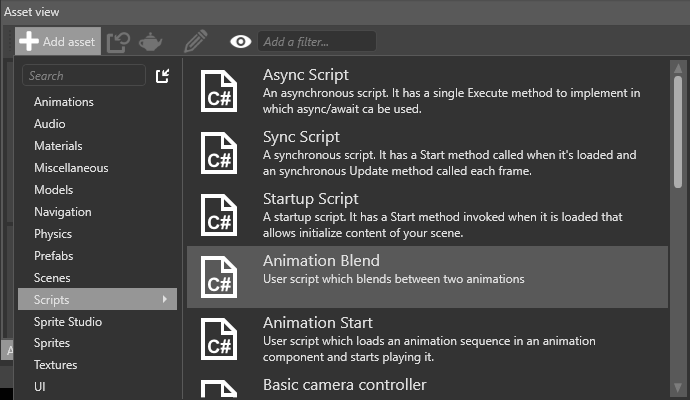

# Set up animations

<span class="label label-doc-level">Beginner</span>
<span class="label label-doc-audience">Designer</span>
<span class="label label-doc-audience">Programmer</span>

This page explains how to add an [AnimationComponent](xref:SiliconStudio.Xenko.Animations.AnimationComponent) to an entity, add animations to the component, and play the animations at runtime using a script.

## 1. Add animations to an entity

To use animations, first add them to the entity in Game Studio. 

>[!Note]
>[If you want to animate an entity, the entity must also have a model component.]

1. In the **scene editor**, select the entity you want to animate.

    

2. In the **property grid**, click **Add component** and choose **Animations**.

    

    Game Studio adds an animation component to the entity.

3. In the animation component properties, next to **Animations**, click the green plus button, type a name for the animation, and press Enter.

    

    >[!Note]
    >When you play animations from scripts later, you use this name, **not** the name of the animation asset. To make identification easy, we recommend you give your animation the same name as the animation asset.
    
4. Click the hand icon (**Pick an asset up**).

    

    The **Asset picker** opens.

5. Browse to the animation asset you want to add and click **OK**.

    

    Game Studio adds the animation asset to the entity.

    

You can add as many animations to the entity as you need. The property grid lists them in alphabetical order.


## 2. Create a script to play the animations

After you add animations to an entity, you need to play them with a script. For more information about scripts, see [Scripts](../scripts/index.md).

### Example script

```
    public class SimpleAnimationScript : StartupScript
    {
        public override void Start()
        {
            Entity.Get<AnimationComponent>().Play("Walk");
        }
    }
```

This script looks for an animation with the name "Walk" under the animation component on the entity.

### Use the pre-built **AnimationStart** script

Xenko includes a pre-built **AnimationStart** script.


To use this script:

1. In the **asset view** (bottom pane by default), click **Add asset**. 

2. Choose **Add asset > Scripts > Animation Start**.

    

3. In the **Script wizard**, specify a name for the script, and click **OK**.

    

    3a. If Game Studio asks if you want to save your script, click **Yes**.
    
    3b. If Game Studio asks if you want to reload the assemblies, click **Yes**.

4. Edit the script as necessary and save it. For the list of options, see the [AnimationComponent API page](xref:SiliconStudio.Xenko.Animations.AnimationComponent).

## 3. Add the script to the entity

1. In the **scene editor**, select the entity you want to animate.

    

2. In the **property grid**, click **Add component** and choose the animation script you want to add.

    

Game Studio adds the script as a component.

You can adjust public variables you define in the script in the property grid under the script component properties.

The first time the animation runs, it offers to load one or more animations, adding them to the list of playing animations on the entity.

## See also

* [Use 3D animations](use-animations.md)
* [Custom blending trees](custom-blending-trees.md)
* [Preview animations](preview-animations.md)
* [Scripts](../scripts/index.md)