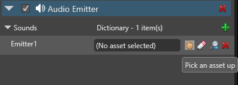

# Audio emitters
**[Audio emitter components](xref="SiliconStudio.Xenko.Audio.AudioEmitter")** emit audio used to create spatialized audio. You can add them to any entity.

The pitch and volume of sound changes as the audio listener moves closer to and away from the audio emitter.

You need to add `Audio Emitter` and `Script`components to the same entity.

> [!Note] 
You also need at least one [AudioListenerComponent](xref="SiliconStudio.Xenko.Audio.AudioListener") in the scene to hear audio from audio emitters.

## Set up an audio emitter

### 1: Add an audio emitter component to an entity

1. In the **Scene view**, select an entity you want to be an audio emitter:

    

2. In the **Property grid**, click **Add component** and select **Audio Emitter**:

    

    Now we need to add a sound to the emitter.

3.  Under **Audio Emitter**, click the green plus icon and specify a name for the sound:

    

4. From the **Asset view**, drag and drop a sound asset to the sound you just added:

    

    Alternatively, to open the **Asset picker**, click the hand icon:

    

    Then choose a sound asset:

    

5. Repeat steps 3 and 4 to add as many sound assets as you need to the emitter entity. For example, a character might make footstep noises when walking and gunshot noises when shooting.

### 2: Create a script
Now we need to create a script to control how the sound is used.

1. Create a script and access the sound assets with the names you specified in the `AudioEmitter Component`.

2. Instantiate [AudioEmitterSoundController](xref="SiliconStudio.Xenko.Audio.AudioEmitterSoundController") for each sound you want to use in the script.

    For example, say we have two sounds, **MySound1** and **MySound2**:

    

    We can access the sounds like this:

```cs
AudioEmitterComponent audioEmitterComponent = Entity.Get<AudioEmitterComponent>();
AudioEmitterSoundController mySound1Controller = audioEmitterComponent["MySound1"];
AudioEmitterSoundController mySound2Controller = audioEmitterComponent["MySound2"];
```

### 3: Define the audio behavior
You can use the following [AudioEmitterSoundController](xref="SiliconStudio.Xenko.Audio.AudioEmitterSoundController") properties and methods to define the audio behavior in the script:

| Property / method | Description |
|-------    |-------|
| [IsLooping](xref="SiliconStudio.Xenko.Audio.AudioEmitterSoundController.IsLooping") | Loops audio. Has no effect if ``PlayAndForget`` is set to true.|
| [Pitch](xref="SiliconStudio.Xenko.Audio.AudioEmitterSoundController.Pitch")     | Gets or sets sound pitch (frequency). Use with caution for spatialized audio. |
| [PlayState](xref="SiliconStudio.Xenko.Audio.AudioEmitterSoundController.PlayState")	| Gets the current state of the audio emitter sound controller. |
| [Volume](xref="SiliconStudio.Xenko.Audio.AudioEmitterSoundController.Volume")	| Volume of the audio. | 
| [Pause()](xref="SiliconStudio.Xenko.Audio.AudioEmitterSoundController.Pause")	| Pauses audio. |
| [Play()](xref="SiliconStudio.Xenko.Audio.AudioEmitterSoundController.Play")      | Plays audio. |
| [PlayAndForget()](xref="SiliconStudio.Xenko.Audio.AudioEmitterSoundController.PlayAndForget")| Plays audio once, then clears the memory. Useful for short sounds such as gunshots. Overrides ``IsLooping``.|
| [Stop()](xref="SiliconStudio.Xenko.Audio.AudioEmitterSoundController.Stop")	| Stops audio. |

For example:

```
mySound2Controller.IsLooping = true;
mySound2Controller.Pitch = 2.0f;
mySound2Controller.Volume = 0.5f;
mySound2Controller.Play();
```

This sound will loop at double the original pitch and half the original volume.

For more information, see the [AudioEmitterSoundController Xenko API documentation](xref="SiliconStudio.Xenko.Audio.AudioEmitterSoundController").

Add the script via a script component to the entity.... for more information about that see this other generic documentation.

### 4: Add the script to the audio emitter entity

Game Studio lists the script as a component. Add the script to the audio emitter entity.

## See also
* [Spatialized audio](spatialized-audio.md)
* [Audio listeners](audio-listeners.md)
* [Global audio settings](global-audio-settings.md)