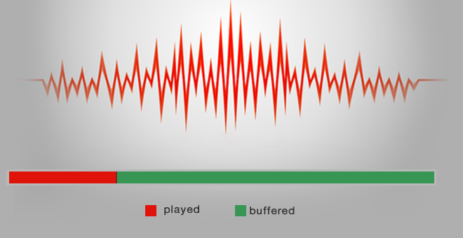
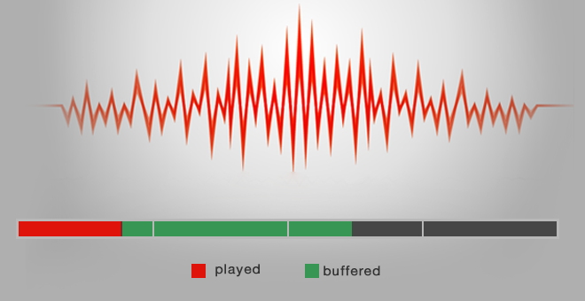
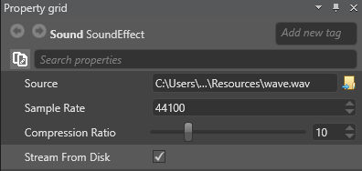

# Stream audio

<span class="label label-doc-level">Beginner</span>
<span class="label label-doc-audience">Designer</span>
<span class="label label-doc-audience">Programmer</span>

By default, Xenko plays audio directly from memory. This is useful for short sound effects such as gunshots or footsteps.



Alternatively, Xenko can buffer audio and stream it in sequences. As soon as the first sequence is buffered, Xenko plays it while buffering the following sequences in parallel. This saves a lot of memory when used for larger audio files such as background music and character dialogue.

> [!Note] 
Streaming audio increases latency unless you preload it with the ReadyToPlay task (see below).



To stream a sound asset:

1. In the **Asset view**, select the sound asset.

2. In the **Property grid**, select **Stream From Disk**:

    

In the script for the asset, you can configure an audio file to play once the audio engine buffers enough audio samples. To do this, use this task:

```cs
SoundInstance music = musicSound.CreateInstance();
await music.ReadyToPlay();
music.Play();
```

## See also
* [Global audio settings](global-audio-settings.md)
* [Sound asset properties](sound-asset-properties.md)
* [Spatialized audio](spatialized-audio.md)
* [Non-spatialized audio](non-spatialized-audio.md)