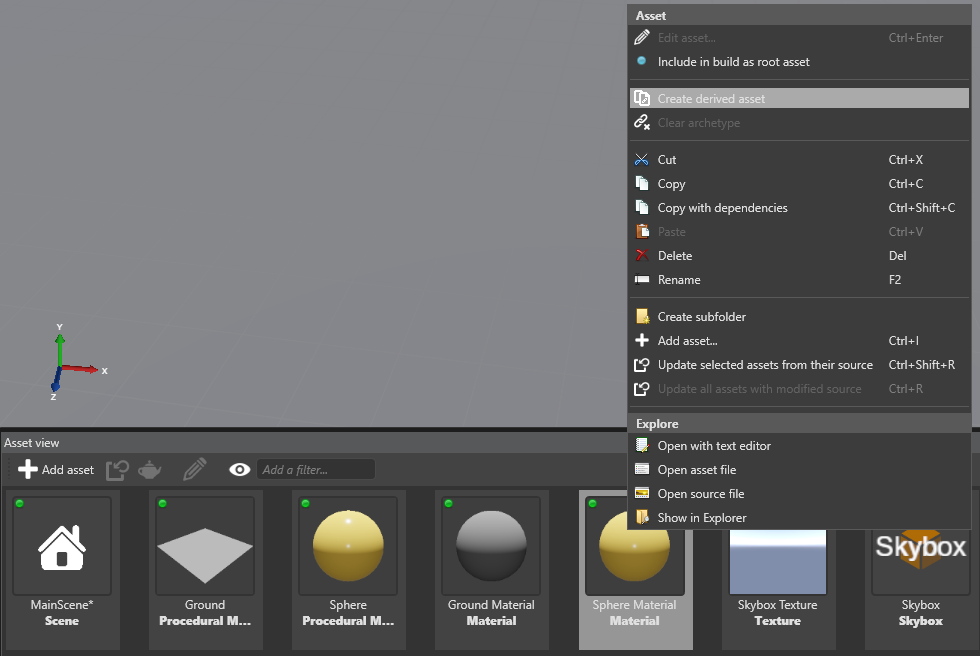
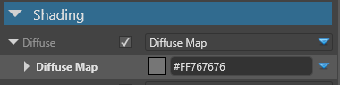
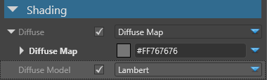
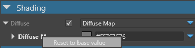
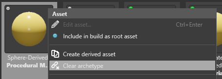

# Archetypes

<span class="label label-doc-level">Intermediate</span>
<span class="label label-doc-audience">Designer</span>

An **archetype** is a master asset that controls the properties of assets you derive from it. You can use archetypes to create **derived** assets - exceptions to the archetype.

For example, imagine you create a game in which the characters wear identical shirts. You can simply give each character the same shirt material asset. If you decide to change the color of the shirt, simply change the color in the asset and every shirt changes. No problem!

But imagine you create a sports game in which the players wear shirts that differ only in color. You could create a single shirt material, duplicate it for every player, 

then customize each material color individually. However, if you then change a property of these materials (eg transparency), you have to edit each material individually.

Instead, you can create a single archetype material and derive other materials from it. 

You can create archetypes from any kind of asset, including audio, models, materials, and so on.

## Create an archetype

In the **Asset View**, right-click the asset you want to make an **archetype** and select **Create derived asset**.



Game Studio adds a new derived asset to the project. The new asset derives all its properties from the archetype.

With the derived asset selected, in the **Property Grid**, the archetype asset is listed under **Archetype**.


> [!Tip] 
> You can right-click the archetype asset in the Property Grid and select **Select the referenced asset** to select the archetype asset.]

## How archetypes and derived assets work

Derived assets are useful when you want to create exceptions to assets.

You can override individual properties of derived assets.

For example, imagine we have three sphere entities that use a single material.

If we change the color in the material to orange, all the spheres change, because they share a single asset.

Now imagine we want *one* sphere to have a different color.


If later on you change the _Same Property_ in **Archetype**, it won't affect the **Derived Asset**.
Any changes you make to an **Archetype** affect only properties of the **Derived Assets** that are identical to this **Archetype**.

Suppose, you do the following actions:

1. Derive a **Material Asset** from an **Archetype**.
2. Change the **Color** of the **Derived Material Asset**.
3. Later, you modify an **Archetype**: change its color and **Transparency** settings in **Misc**.
4. **Transparency** of the **Derived Material Asset** will change exactly as in **Archetype**.
5. **Color** of the **Derived Asset** will not be affected, as you've already customized this property.

### Reset to base values

In **Property Grid**, you can see which properties of the **Derived Asset** differ from the **Archetype**: 

* **Overridden** and **unique** properties are **white**:

     

* **Identical** properties are **gray**:

     

In the **Property Grid**, you can select **Display only overridden properties** to display only properties that differ from the **archetype**:

 

You can reset overridden or unique properties of a derived asset to the values in the archetype. To do this, right-click the overriden property and select **Reset to base value**.



### Clear an archetype

You can remove the link between the archetype and the derived asset. In the **Asset View**, right-click the derived asset and select **Clear archetype**. The derived asset is now independent of the archetype.



## Use archetypes

You can create a hierarchy of **Archetypes** and **Derived** assets.

You can derive an **Asset** from an **Archetype**, and then derive another **Asset** from that **Derived Asset**.
This way you can create different layers of _Asset Properties_ to keep your project organized:

```cs
Archetype
    Derived Asset
        Derived Asset
```

## See also

1. [Prefabs](prefabs.md)
2. [Manage prefabs](manage-prefabs.md)