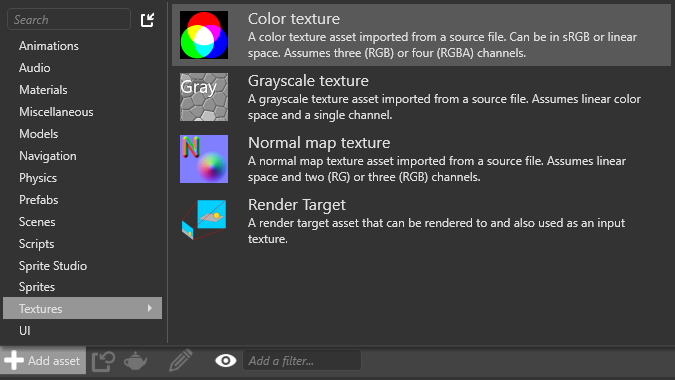
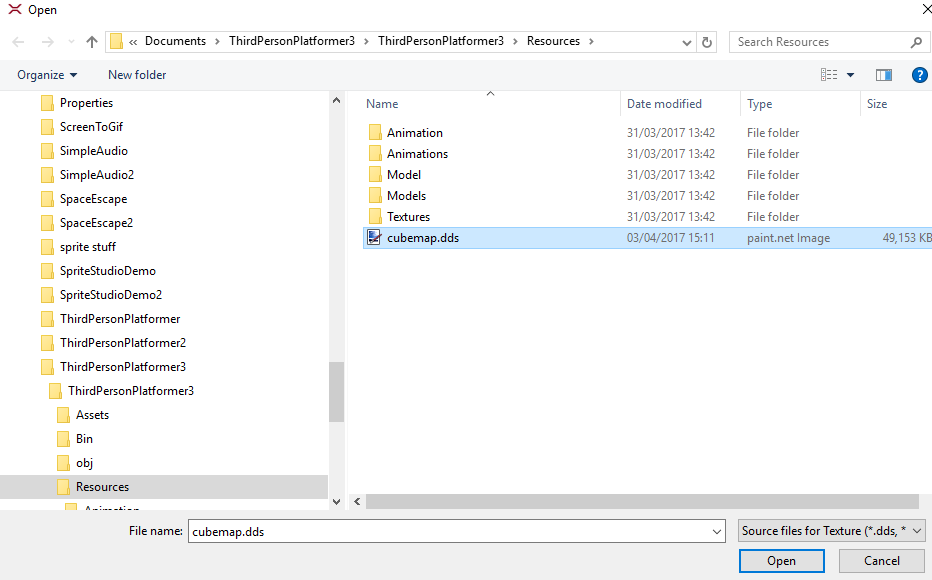

## Create a cubemap

*Cubemaps** are six-sided textures used for purposes such as [skyboxes](../graphics/skyboxes.md).

 Xenko uses cubemaps with the extension `.dds`. Currently, Game Studio can't convert image files to `.dds` files. Use another application to create a cubemap from separate image files, such as:

* [Nvidia conversion tool](https://developer.nvidia.com/nvidia-texture-tools-adobe-photoshop)
* [ATI conversion tool](http://developer.amd.com/tools-and-sdks/archive/games-cgi/cubemapgen)

## Create a cubemap in Game Studio

You can capture a cubemap from a position in your scene.

1. In the **scene editor**, position the camera at the point where you want to capture the cubemap. The direction the camera faces doesn't matter.

2. In the scene editor toolbar, click **Generate cubemap**.

3. Browse to the location on disk you want to save the cubemap, specify a name, and click **Save**.

>![Tip]
>We recommend you save the cubemap in your project **Resources** folder. For more information, see [Organize your files in version control](../files-and-folders/organize-your-files-in-version-control.md).

Game Studio creates a cubemap `.dds` file in the location you specified.

## Use a cubemap

To use a cubemap in Game Studio, import it as an asset.

1. In the **asset view** (at the bottom by default), click **Add asset** and select **Textures > Color texture**.

    

2. Browse to the cubemap `.dds` file and select click **Open**.

    

3. Game Studio adds the cubemap as a texture.

    [Cubemap in asset view)(media/cubemap-in-asset-view.png)

You can now use the cubemap in your scene. For example, you can use it in a [skybox](../graphics/skyboxes.md).

## See also

* [Skyboxes](../graphics/skyboxes.md)