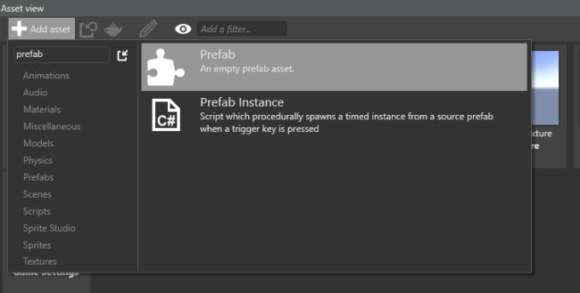
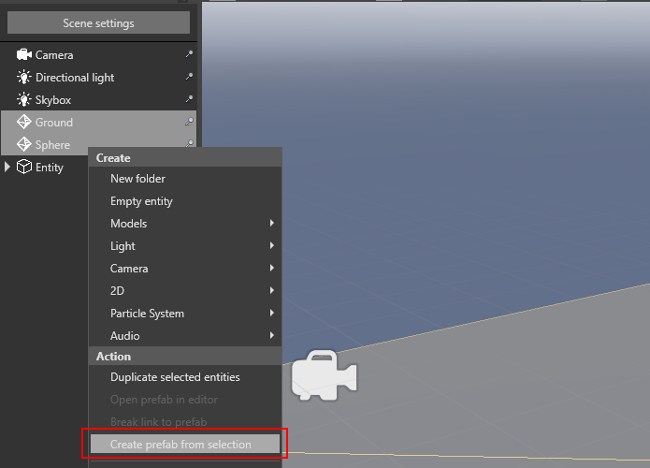

# Create a prefab
Beginner
Designer

In the **Asset view**, click **Add asset** and select **Prefabs** > **Prefab**.

Game Studio creates an empty prefab asset with the default name *Prefab*. Double-click the asset to open the **Prefab Editor** and add entities.

## Create a prefab from an entity

You can also create a prefab from an existing entity or entities.

1. In the **Scene Editor**, select the entity or entities you want to create a prefab from.
>[!Tip] 
> Hold Ctrl to select multiple items.
2. Right-click the selection and select **Create prefab from selection**:

Game Studio creates a prefab asset from the entity or entities you selected. You can access the new prefab from the **Asset view**. 

>[!Note]
>After you create a prefab from a selection, the original entity or entities you selected don't become a prefab. They remain independent and don't receive future changes to the prefab. For this reason, it's good practice to delete the original selection and replace them with the new prefab.

You can create new prefabs from modified prefabs. For example, you can instantiate a prefab, override one of its properties, then use this modified prefab instance to create a new prefab.

## See also
1. [Prefabs](prefabs.md)
2. [Manage prefabs](manage-prefabs.md)
3. [Modify prefabs](modify-prefabs.md)
4. [Use prefabs](use-prefabs.md)