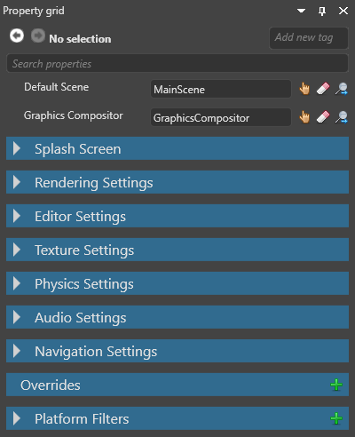
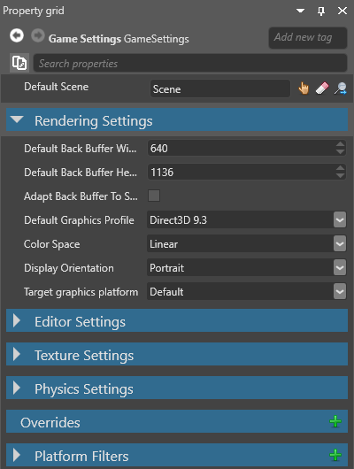
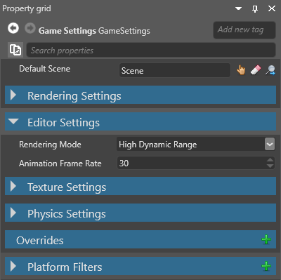
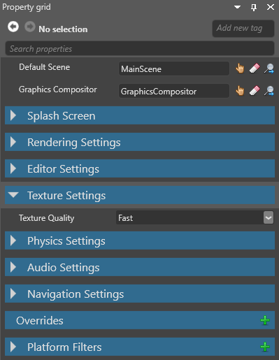
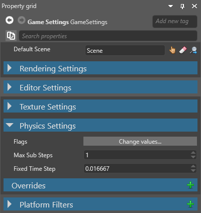
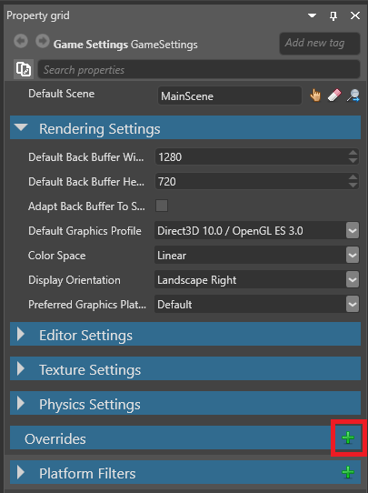

# Game settings

Beginner
Programmer
Designer

You can configure the global settings of your game in the **Game Settings** asset. By default, this is stored in your project **Assets** folder.

## Edit Game Settings

1. In the **solution explorer** (the bottom-left pane by default), select the **Assets folder**.

    

2. In the **asset view** (the bottom pane by default), select the **GameSettings** asset.

    

3. In the **property grid** (the right-hand pane by default), edit the Game Settings properties.

   

### Default scene

You can have multiple scenes in your project. Xenko loads the default scene at runtime.

To set the default scene:

1. In the **GameSettings** properties, next to **Default Scene**, click the **Asset picker** button.
    
    

    The **asset picker** opens.

2. Select the default scene in the asset picker and click **OK**.

For more information about scenes, see [Introduction to scenes](../get-started/introduction-to-scenes.md).

### Rendering settings

| Property                    | Description                                                                                                                                                                     |
|-----------------------------|---------------------------------------------------------------------------------------------------------------------------------------------------------------------------------|
| Default back buffer width   | This might be overridden depending on the ratio and/or resolution of the device. On Windows, this is the window size. On Android/iOS, this is the off-screen target resolution. |
| Default back buffer height  | This might be overridden depending on the ratio and/or resolution of the device. On Windows, this is the window size. On Android/iOS, this is the off-screen target resolution. |
| Adapt back buffer to screen | If enabled, this option adapts the ratio of the back buffer to fit the screen ratio.                                                                                            |
| Default graphics profile    | The graphics feature level required by the project.                                                                                                                             |
| Color space                 | The color space (gamma or linear) used for rendering. This affects the game at runtime and how elements are displayed in Game Studio.                                           |
| Display orientation         | The display orientation of the game (default, portrait, left landscape, or right landscape).                                                                                    |
| Target graphics platform    | The target platform Xenko builds the project for. If you set this to **Default**, Xenko chooses the most appropriate platform.                                                                                                   |
### Editor settings

The editor settings control how Game Studio displays entities in the scene editor. These settings have no effect on your game at runtime.

>[!Note]
>The **Color space** setting under **Rendering settings** also affects how Game Studio displays entities in the scene editor.

| Property            | Description                                                                           |
|---------------------|---------------------------------------------------------------------------------------|
| Rendering mode      | How Game Studio renders thumbnails and asset previews.                                |
| Animation framerate | The framerate of animations shown in Game Studio. This doesn't affect animation data. |

### Texture settings

| Property        | Description                                                                                                                                                    |
|-----------------|----------------------------------------------------------------------------------------------------------------------------------------------------------------|
| Texture quality | The texture quality when encoding textures. **Fast** uses the least CPU, but has the lowest quality. Higher settings might result in slower builds, depending on the target platform. |

### Physics settings

| Property        | Description                                                                                                                                                                                                                                                                                  |
|-----------------|----------------------------------------------------------------------------------------------------------------------------------------------------------------------------------------------------------------------------------------------------------------------------------------------|
| Flags           | **CollisionsOnly** disables [physics](../physics/index.md) except for collisions. For example, if this is enabled, objects aren't moved by gravity, but will still collide if you move them manually. **ContinuousCollisionDetection** prevents fast-moving entities erroneously moving through other entities. Note: other flags listed here aren't enabled yet, and will work in future versions. |
| Max sub steps   | The maximum number of simulations the the physics engine can run in a frame to compensate for slowdown.                                                                                                                                                                                      |
| Fixed time step | The length in seconds of a physics simulation frame. The default is 0.016667 (one sixtieth of a second).                                                                                                                                                                                                                                       |       |

### Overrides

You can override settings for particular platforms, graphics APIs, and so on. For example, you can set different texture qualities for different platforms.

1. With the **GameSettings** asset selected, in the **property grid**, under **Overrides**, click the **green plus icon**.

    

    Game Studio adds an override.

2. In the new override, next to **Platforms**, select the platforms you want the override to apply to. You can select as many as you need.

    

3. **Optional**: If you want this override to apply only to a specific GPU platform, choose it from the **Specific Filter** drop-down list.

    

    You can add GPU platforms to this list under **Platform filters** (see **Add a platform filter** below).

4. In the **Configuration** drop-down menu, select the kind of setting you want to override (**Editor**, **Texture**, **Rendering** or **Physics**).

    

5. Set the options you want to override.

#### Add a platform filter

You can choose items in the **Platform Filters** list as a specific platform filter when you set an override (see above).

1. With the **GameSettings** asset selected, in the **property grid**, expand **Platform Filters**.

    The property grid displays a list of platform filters you can use.

    

2. At the bottom of the list, click **Add to Platform Filters**.

    Game Studio adds a new empty item.

3. In the item field, type the GPU filter you want to add.

    

After you add a platform filter, you can select it as a **specific filter** under **Overrides**.

>[!Note]
>If the new filter isn't listed, remove the override and re-add it.

## See also

* [Assets](../get-started/assets.md)