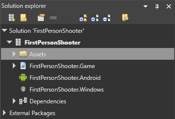
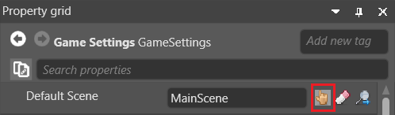
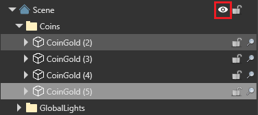

# Manage scenes

Beginner
Programmer
Designer

Scenes and entities are arranged in a hierarchy, with the **root scene** at the top. This hierarchy is displayed in the **entity tree** in the scene editor on the left.

The root scene contains all the scenes and entities in your game. It should contain common entities that the other scenes and entities use, such as game logic scripts.

Scenes are kept in different folders. This means that different people can work on them without overwriting each other's work.

## Parent and child scenes

The relationship between parent and child scenes is set on the child, not the parent. In other words, child scenes know about their parent scenes, but parent scenes don't know about their child scenes.

There are several ways to make a scene a child of another scene:

* In the scene editor **entity tree** (left by default), drag the scene onto the scene you want to make its parent.

* Drag the scene from the **asset view** (bottom by default) onto the scene you want to make its parent in the **entity tree**.

* In the scene **property grid** (on the right by default), next to **Parent**, specify the scene you want to be the scene's parent.

    

## Specify a default scene

The **default scene** is the scene Xenko loads at runtime. You can set this in the [Game Settings](game-settings.md) asset.

1. In the **solution explorer** (the bottom-left pane by default), select the **Assets folder**.

    

2. In the **asset view** (the bottom pane by default), select the **GameSettings** asset.

    

3. In the **property grid** (the right-hand pane by default), next to **Default Scene**, click the **Asset picker** button.
    
    

    The **asset picker** opens.

2. Select the default scene in the asset picker and click **OK**.

Xenko loads this scene at runtime.

For more information about the Game Settings asset, see [Game Settings](game-settings.md).

## Lock scenes and entities

You can lock scenes and entities so they can't be selected in the main window. This is useful when you have lots of things in your scene. You can still select scenes and entities in the entity tree.

To lock or unlock a scene or entity, in the entity tree, click the **padlock** icon.

>[!Tip]
>When you lock a scene, all its child scenes and entities are locked too. To lock an entity along with its child entities, hold **Ctrl** and click the padlock item.

Locked items have a **gold locked padlock** icon in the entity tree.

    

## Load and unload scenes in the scene editor

You can load and unload scenes (with all their child scenes and entities) in the scene editor. Unloading scenes is useful if, for example, you want to remove clutter from your editing view, or improve editor performance.

The screenshots below show a root scene with child scenes loaded and unloaded. The root scene contains entities that all the scenes use, including the [skybox](../graphics/skyboxes.md), [scripts](../scripts/index.md), asteroids, and player character. The child scenes are sections of level.

To load or unload a scene, in the **scene editor**, in the **entity tree** on the left, next to the scene you want to load or unload, click the **eye icon**.

## Move a scene

As scenes aren't entities, they don't have transform components. However, you can move a scene using its **offset** property.

To move a scene at runtime, use:

`myScene.Offset = new Vector3(x, y, z);`

Replace `myScene` with the name of the scene, and `x,y,z` with the XYZ coordinates you want to move the scene to.

## See also

* [Create and open a scene](create-a-scene.md)
* [Navigate in the scene editor](navigate-in-the-scene-editor.md)
* [Load scenes](load-scenes.md)
* [Add entities](add-entities.md)
* [Manage entities](manage-entities.md)