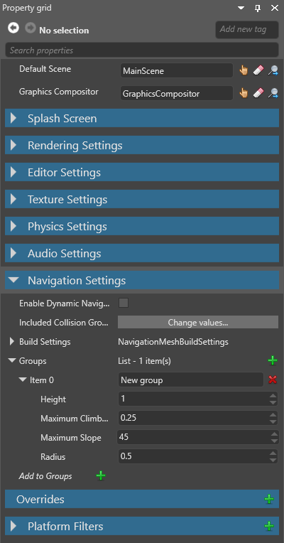
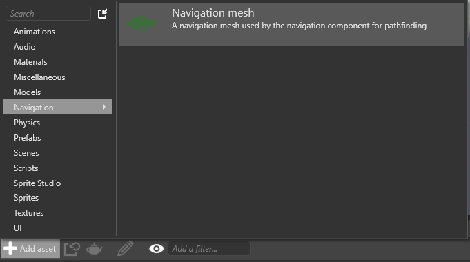

# Navigation

<span class="label label-doc-level">Beginner</span>
<span class="label label-doc-audience">Level designer</span>
<span class="label label-doc-audience">Programmer</span>

You can use the **navigation** system to control how characters and other objects navigate scenes. The navigation system comprises several elements:

* navigation groups
* navigation meshes
* navigation bounding boxes
* navigation components

## 1. Create a navigation group

**Navigation groups** define different navigation properties for the entities you add to them. These are defined in the project **game settings**.

You can create different navigation groups for different kinds of entities. For example, if your game features vehicles controlled by scripts, you might create different navigation groups for different sizes of vehicle, each with different properties: a car group, a bus group, a motorcycle group, and so on.

1. In the **solution explorer** (the bottom-left pane by default), select the **Assets folder**.

    

2. In the **asset view** (the bottom pane by default), select the **Game Settings** asset.

    

3. In the **property grid** (the right-hand pane by default), expand **Navigation Settings**.

   

4. Next to **Groups**, click the **green plus** icon.

    Game Studio adds a new item to the list of navigation groups.

    

5. Set the properties for the navigation group. Entities you add to this group use these properties.

### Navigation group properties

| Property             | Description
|----------------------|------------
| Item                 | The name of the group
| Height               | The height of the entities in this group. Entities can't enter areas with ceilings lower than this value.
| Maximum climb height | The maximum height that entities in this group can climb. In most cases, this should be approximately the same value as the **step height** property in the [character component](../physics/characters.md) of the entities in this group, if they have one.
| Maximum slope        | The maximum incline (in degrees) that entities in this group can climb. Entities can't go up or down slopes higher than this value. In most cases, this should be approximately the same value as the **max slope** property in the [character component](../physics/characters.md) of the entities in this group, if they have one.
| Radius               | The size of the entities in this group. The larger this value, the larger the area of the navigation mesh they use.

## 2. Add a navigation mesh

The **navigation mesh** is the area that entities can navigate.

1. In the **asset view** (bottom by default), click **Add asset > Navigation > Navigation mesh**.

    

    Game Studio adds a navigation mesh asset to your project.

    

2. With the navigation mesh selected in the **asset view**, in the **property grid**, set the **scene** the navigation mesh applies to.

    

    For more information about scenes, see [Scenes](scenes.md).

3. Under **Selected groups**, click the **green plus** icon.

    Game Studio adds a new item to the list of navigation groups that use the navigation mesh.

    

4. Click the **blue arrow** icon and choose a group from the drop-down menu.

    

    The group uses this navigation mesh.

5. Repeat steps 3 and 4 for as many groups as you want to use the navigation mesh.

### Navigation mesh properties

| Property                  | Description                                                    
|---------------------------|--------------
| Scene                     | The scene this navigation mesh applies to
| Included collision groups |  Set which collision groups the navigation mesh uses. The default is **Custom Filter 1**
| Build settings            | Advanced settings for the navigation mesh
| Groups                    | The groups that use this navigation mesh

## 3. Add a navigation bounding box

The **navigation bounding box** defines the area the navigation mesh covers. You can use it to create smaller navigation areas in your scene, rather than having the mesh cover the entire scene.

To create a navigation bounding box, add it to an entity as a component.

1. In the scene, select the entity you want to contain the bounding box, or create a new entity.

2. With the entity selected, in the **property grid**, click **Add component** and select **Navigation bounding box**. 

    

    Game Studio adds a navigation bounding box to the entity.

3. Under the **Navigation bounding box** component properties, use the **XYZ** values to set the size of the bounding box.

    

4. Use the entity's **transform component** to position the bounding box in your scene.

## 4. Add a navigation component

**Navigation components** allow entities to use navigation meshes.

1. Select an entity you want to use navigation.

2. In the **property grid**, click **Add component** and select **Navigation**.

    

    Game Studio adds a navigation component to the entity.

3. Under the **Navigation** component properties, next to **Navigation mesh**, click the **hand icon** to open the **asset picker**.

    

4. In the asset picker, select the navigation mesh you want the entity to use and click **OK**.

    

5. Under **Group**, select the navigation group the entity should belong to. The entity uses the navigation properties you set in this group.

    

## 5. Use navigation in a script

Use the navigation components in your scripts. For example:

```cs
void Move(Vector3 from, Vector3 to)
{
	var navigationComponent = Entity.Get<NavigationComponent>();
	List<Vector3> path = new List<Vector3>();
	if(navigationComponent.TryFindPath(from, to, path))
	{
		// Follow the points in path
	}
	else
	{
		// A path couldn't be found using this navigation mesh
	}
}
```

For more information, see the [NavigationComponent API documentation](xref:SiliconStudio.Xenko.Engine.NavigationComponent).

## Show or hide navigation meshes in the scene editor

To show or hide a navigation mesh in the scene editor, use the **navigation visibility** menu in the scene editor toolbar.


Use the checkboxes to show or hide navigation meshes belonging to different groups. The colored boxes indicate the color of the groups displayed in the scene editor.

| Navigation mesh hidden   | Navigation mesh shown
|----------------------|------------
| | 

These options have no effect on runtime behavior.

## Show or hide the bounding box in the scene editor

In the scene editor toolbar, open the **gizmo options** menu and use the **Navigation bounding box** checkbox.


| Bounding box hidden | Bounding box shown (note blue box outline) 
|----------------------|------------
||  

## Sample project

For an example of how to implement navigation, see the **top-down RPG** sample project included with Xenko.

## See also

* [Physics - Characters](../physics/characters.md)
* [Scenes](scenes.md)