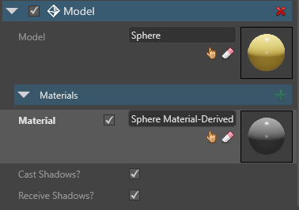
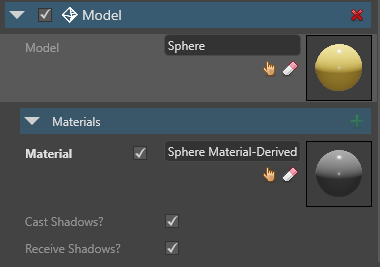
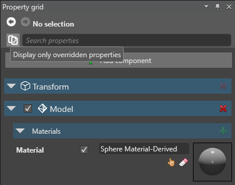
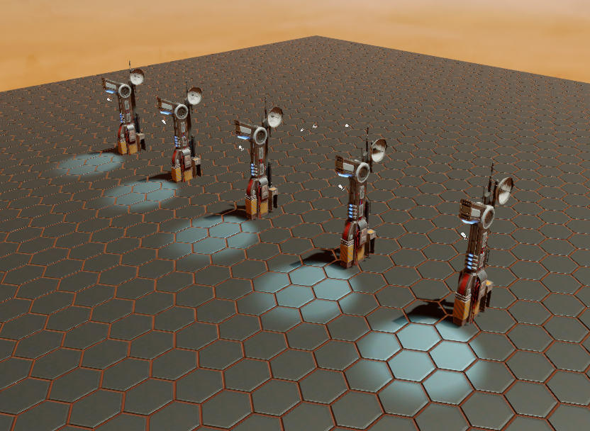
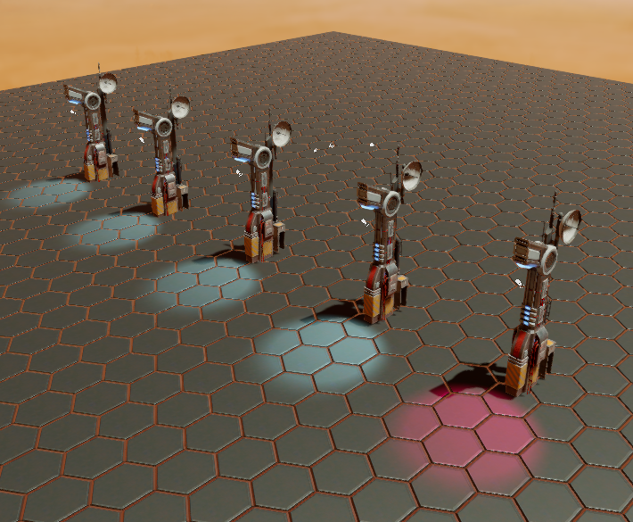
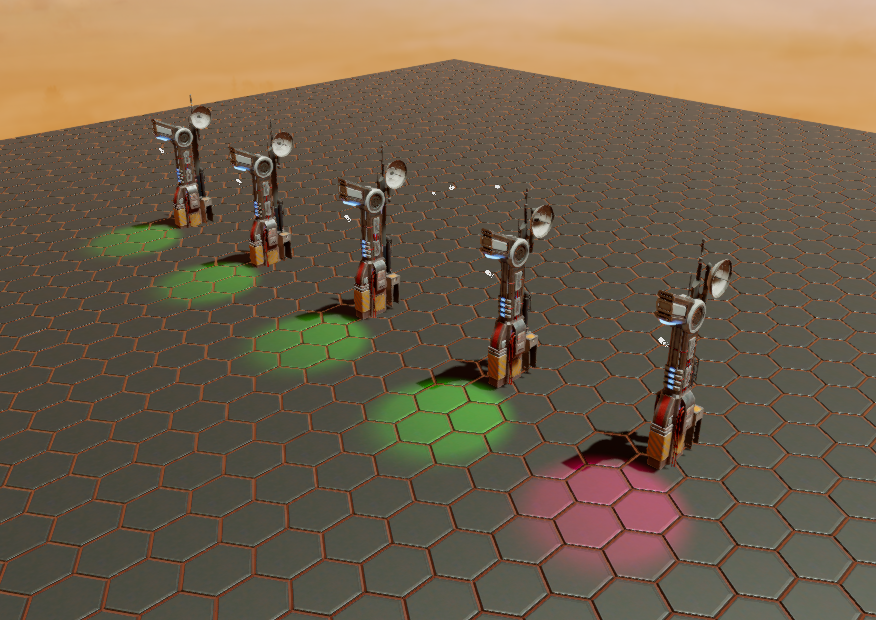

# Override prefab properties
Intermediate
Programmer
Designer

When you change a property in an instance created from a prefab, the prefab itself isn't affected - only that instance. This is called an **override**. 

* If the property in the prefab and the prefab instance is **identical**, the instance inherits changes from the prefab for that property.

* If the property in the prefab and the prefab instance is **different**, the instance doesn't inherit changes from the prefab for that property.

In the following video, the **Lamp** prefab contains several box entities that belong to the **Boxes** parent. When we delete the boxes from the instance, only that instance is affected. The prefab (shown on the right) is unchanged.

If we add another box to the Boxes parent in the prefab, it doesn't appear in the overridden instance. That's because we deleted the Boxes parent from that instance.

<video autoplay loop class="responsive-video" poster="media/delete-boxes-from-prefab-instance.jpg">
   <source src="media/delete-boxes-from-prefab-instance.mp4" type="video/mp4">
</video>

## View overridden properties

In the **Property grid**, you can see which properties of the prefab instance differ from the base values in the prefab.

* **Overridden** and **unique** properties are **white**:

     

* **Identical** properties are **gray**:

    

### Display only overriden properties

To display only overridden properties, in the **Property grid**, next to the **Search** field, click  (**Display only overriden properties**):

### Reset a property to the prefab value

To reset an overridden property to the value in the parent prefab, right-click the property and click **Reset to base value**.

## Example

In this example, we have a prefab of a futuristic lamppost.

The lamppost prefab is composed of three entities: a column, a pillar, and a spot light. These are listed in the entity tree in the Prefab Editor.

Let's add five instances of the lamppost prefab to our scene.

Now let's modify one of the instances. In the Scene Editor, we select one **spot light** entity and, in the spot light component properties, change its color to red. The Properties Grid displays the modified **Color** property in **bold**. This means it's overriding the prefab property.

We can see this in the scene view.

Now let's see what happens when we go back to the Prefab Editor and change the color of the spot light in the prefab to green.

Four of the lampposts now have a green light. The fifth is still red, as overridden properties don't change when you modify the prefab.

## See also

* [Prefab index](prefabs.md)
* [Create prefabs](create-prefabs.md)
* [Use prefabs](use-prefabs.md)
* [Edit prefabs](edit-prefabs.md)
* [Nested prefabs](nested-prefabs.md)