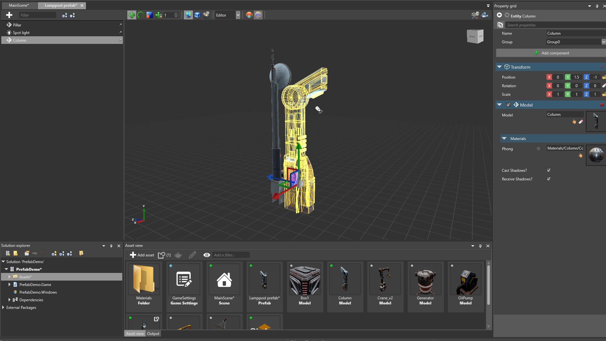

# Prefab Editor
Intermediate
Designer

You can edit prefabs in the **Prefab Editor**.

The Prefab Editor works similarly to the Scene Editor. For example, you can:

* add and delete entities
* use [transformation gizmos](../get-started/arrange-entities.md) to translate, rotate and scale entities
* create parent-child relations between entities
* add and modify entity components (scripts, materials, models, animations, etc)

For more information about managing entities, see [Populate a scene](../get-started/populate-a-scene.md).

When you edit a prefab in the Prefab Editor, the changes are applied to the instances of the prefab in the scene in **real time**.

This video demonstrates what happens when we make changes to the prefab. The Scene Editor is on the left, and the Prefab Editor on the right:

<video autoplay loop class="responsive-video" poster="media/edit-prefab-and-update-instances.jpg">
   <source src="media/edit-prefab-and-update-instances.mp4" type="video/mp4">
</video>

When you edit an instance of a prefab in the scene, the prefab isn't affected. For example, if you add an entity to a prefab instance, only that instance is affected.

In the following video, the **Lamp** prefab contains several box entities that belong to the **Boxes** parent. When we delete the boxes from the instance, only that instance is affected. The prefab (shown on the right) is unchanged.

If we then add another box to the Boxes parent in the prefab, it doesn't appear in the overridden instance. This is because we deleted the Boxes parent from that instance.

 

>[!Note]
>At runtime, changes to prefabs don't affect existing prefab instances.

>For example, imagine you have a tree prefab that contains a script to change the tree color from green to red at certain point at runtime. The script doesn't affect existing instances of the prefab; it can only change the color of **future** instances. Prefabs instantiated after the code runs have the new color, but existing prefabs don't.