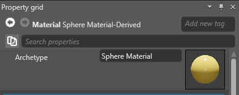

Intermediate
Designer

# Archetypes

Sometimes you require a set **Assets** that have identical properties.
Suppose, you create a simple sports simulator. Players wear nearly identical t-shirts that differ only in color.

You can create one t-shirt **Material**, copy it several times, and then customize each **Material** separately.
If later on you decide to change some specific _Property_ of these materials (e.g. change transparency settings), you would have to go through each **Material**.

That's when **Archetypes** come in handy.
An **Archetype** is essentially a **Master Asset** that controls **Core Properties** of the **Derived Assets**.
Here's how you can use **Archetypes**:

1. Create a **Archetype** to set its _Core Properties_.
2. Create **Derived Assets** that inherit _Core Properties_ from the **Archetype**.
3. Adjust _Core Properties_ in the **Archetype**, if needed.
4. Customize _Minor Properties_ of each **Derived Asset** individually.

## Create Archetypes

**1)** In **Asset View**, right-click the Asset you want to be an **Archetype**.

**2)** Click _Create Derived Asset_:

**3)** In **Asset View**, select the **Derived Asset**.

**4)** Go to **Property Grid** to see that this **Asset** has an **Archetype**.

**5)** You can click on **Archetype** image to locate **Archetype Asset** in **Asset View**.

## Manage Archetypes
Suppose, you change some property of the **Derived Asset**.
If later on you change the **same property** of an **Archetype**, it won't affect the **Derived Asset**.

Any changes you make to an **Archetype** affect only properties of the **Derived Assets** that are identical to that **Archetype**.
Suppose, you do the following actions:

1. Derive a **Material Asset** from the **Archetype**.
2. Change only the **Color** of the **Derived Material Asset**.
3. Later modify an **Archetype**: change its color and **Transparency** settings in **Misc**.
4. **Transparency** of the **Derived Material Asset** will change exactly as in the **Archetype**.
5. **Color** of the **Derived Asset** will not be affected, as you've already customized this property.

## Use Archetypes

**Archetypes** also help you optimize PC productivity.
For instance, Xenko loads textures of the **Archetype** once, rather than loading the same **Textures** for all copies of the **Material**.

You can create a whole hierarchy of **Archetypes** and **Derived** assets.

You can derive an **Asset** from an **Archetype**, and then derive another **Asset** from that **Derived Asset**.
This way you can create different layers of **Asset Properties** to keep your game project consistent and controllable.