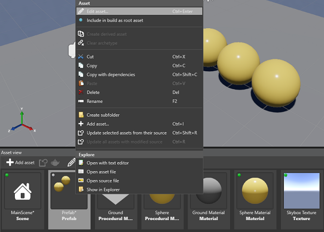

Intermediate
Designer

# Create & Manage Prefabs
Sometimes you need to change a certain _Property_ of all **Prefab Instances**.
In other situations you need to customize each **Prefab Instance** independently from the **Prefab**.
Xenko allows all of these manipulations:

1. Add, manage and delete **Prefab Elements** without compromising **Entities** you used to create this **Prefab**.
2. Change **Prefab** _Properties_ and all its **Instances** with identical _Properties_ will inherit these changes.
3. Customize _Properties_ of **Prefab Instance** and changes to **Prefab** will no longer affect these _Properties_.

Here's how **Prefabs** and **Prefab Instances** relate to one another:

## Create Prefabs

### Option 1: Create Prefab from Asset View

In **Asset View**, create an **Empty Prefab** with **Add Asset** button:

### Option 2: Create Prefab from Scene Editor

**1)** In **Scene Editor**, select a group of **Entities**.

**2)** Right-click on the selection and press **Create Prefab from Selection**:

## Manage Prefabs
Open **Prefab Editor** with either option:

**1)** In **Asset View**, right-click on the **Prefab** and press _Edit Asset_:

**2)** In **Asset View**, Double-click on the **Prefab** to open it in the **Editor**.

**Prefab Editor** is very similar to **Scene Editor**.
It allows you to:

* Use transformation gizmos to _Translate_, _Rotate_ and _Scale_ **Entities** of a **Prefab**.
For more information on using gizmos, see [Arrange Entities](../get-started/arrange-entities.md).
* Add/delete **Entities** to/from **Prefab**.
* Create **Parent-Child** relations between **Entities** of the **Prefab**.
* Add and modify various components of these **Entities**: scripts, materials, models, animations, etc.

For more information on managing **Entities**, see [Populate a Scene](../get-started/populate-a-scene.md).

## Manage Prefabs

## Use Prefabs

Every **Prefab** is a special **Asset** that you can instantiate by dragging and dropping it from the **Asset View** to the **Scene**.
For more information, see [Use Prefabs](use-prefabs.md).