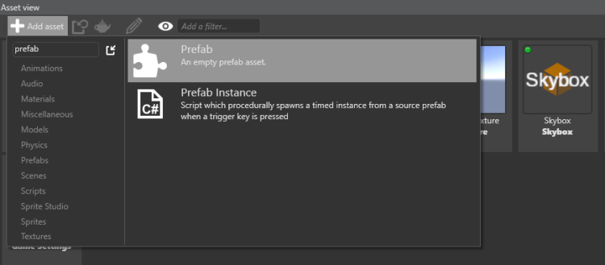
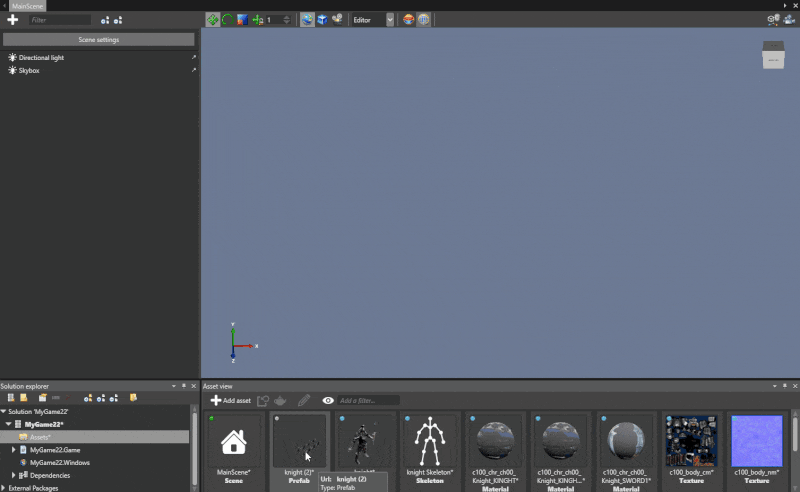

#Use Prefabs

<span class="label label-doc-level">Intermediate</span>
<span class="label label-doc-audience">Programmer</span>
<span class="label label-doc-audience">Designer</span>

**Prefabs** are groups of **Entities** that help you create identical elements in a game.
Prefabs are ideal for things like scenery and props.

You can combine any **Entities** in a **Prefab**: be it a group of four simple identical trees or a complex combination of sprites, models, cameras and any other **Entities**.
**Prefabs** help you easily scale game levels and re-use same **Prefabs** in different levels.

##Use Prefabs from Game Studio

###Create Prefabs

You can create **Prefabs** in two ways:

1) Create an **Empty Prefab** with **Add Asset** button in **Asset View**:



_Create New Prefab_

2) Select a group of **Entities** in **Scene Editor** and create a **Prefab**:


_Create Prefab from Selection_

**Prefabs** are essentially **Assets**.
So just like any other asset, you can instantiate a **Prefab** by dragging and dropping it from the **Asset View** to the **Scene Editor**.

Here's how **Prefabs** help you create a whole army of knights:



_Use prefabs_

###Edit Prefabs

In **Asset View** Double-click on the **Prefab** to edit it in the Editor.
**Prefab Editor** is very similar to **Scene Editor**. You can add/delete **Entities** to/from a **Prefab**.
You can also add and modify various components of these **Entities**: scripts, materials, models, animations, etc.

For more information on using **Entities** and their components, see [Populate a Scene](get-started/populate-a-scene.md).

> [!Note] When you modify a **Prefab**, all its instances change accordingly in the current **Scene** as well as in **all other scenes** where the prefab is used.
> Yet, you can personalize each instance of the **Prefab** individually, with out changing the Prefab itself.

##Use Prefabs from Scripts

In order to use **Prefabs** in runtime, you need to instantiate them.
Suppose you have a **Prefab** called _'MyBulletPrefab'_. It is in the root of your project, and you want to create an instance of that Prefab in your scene.
Use the following code sample:

````cs
private void InstantiateBulletPrefab()
{
    // Note that "MyBulletPrefab" refers to the name and location of your prefab Asset
    var myBulletPrefab = Asset.Load<Prefab>("MyBulletPrefab");
    
    // Assume there is only one top-level entity (could be multiple)
    var bullet = myBulletPrefab.Instantiate().First();

    // Change the X coordinate
    bullet.Transform.Position.X = 20.0f;
    
    // Add the bullet to the scene
    SceneSystem.SceneInstance.Scene.Entities.Add(bullet);
}
````

Sometimes you need to change certain properties of a **Prefab** in runtime.

Suppose you have a _ChangeTreeColor_ script. At certain point in the game, this script changes tree color from green to red in a forest prefab.
These changes won't affect **Existing Instances** of the **Prefab** that were instantiated before the _ChangeTreeColor_ script was introduced.
Yet, all **New Instances** of the forest prefab **will be red**.