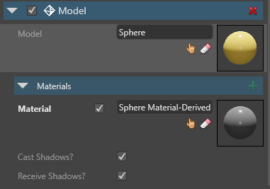

# Use Prefabs
<span class="label label-doc-level">Intermediate</span>
<span class="label label-doc-audience">Programmer</span>
<span class="label label-doc-audience">Designer</span>

Once you [Create a Prefab](create-and-manage-prefabs.md), you can use it in the Scene:

1. Instantiate.
2. Modify these **Instances**.
3. Reset values to the property of the parent prefab.
3. Use **Scripts** to animate **Prefab Instances** at runtime.

## Create Prefab Instances
To instantiate a **Prefab**, drag and drop it from **Asset View** to the **Scene**.

> [!Tip] To create a **Nested Prefab**, you can also drag and drop it from **Asset View** to **Prefab Editor**.

When you add a **Prefab** to a scene, you create its **Instance**.
In Scene Editor, **Prefab Instance** is displayed as **Parent Entity** and **Prefab Elements** as its **Children**.


You can re-arrange **Entities** of the **Prefab Instance** just like you do with other **Entities**:

* Create **Child** and **Parent** entities.
* Drag **Entities** to add them to the **Prefab Instance**.
* Drag **Entities** away from the **Prefab Instance** to make them independent entities.

Sometimes, you instantiate a Prefab, modify it, and then want to re-use this modified **Prefab**.
In that case, simply create a new **Prefab** from the **Prefab Instance**. You can further re-use it like a separate Prefab.

## Modify Prefab Instances
### Adjust in Scene Editor
Once you create **Prefab Instance**, customize it like any other **Entity**:

* Use transformation gizmos to _Translate_, _Rotate_ and _Scale_.
* Change **Materials** and **Textures**.
* **Add Components**, e.g. **Scripts**, **Animations**, etc.

You can customize **Prefab Instance** as a single unit, or edit any of its **Child Entities** independently.
For more information on **Entities** and their components, see [Populate a Scene](../get-started/populate-a-scene.md).

> [!Note] When you modify **Prefab Instances**, the **Prefab** itself **is unaffected**.

### Access Prefab from its Instance

You can access **Prefab** from its **Instances**.
In **Scene Editor**, right-click any child of a **Prefab Instance** and select _Open Prefab in Editor_.


### Reset Properties to Base Values
In **Property Grid**, you can see which properties of the **Prefab instance** differ from the **Prefab**: 

* **Overridden** and **unique** properties appear **white**.

     

* **Identical** properties appear **gray**.

     

In **Property Grid**, you can also press **Display only overriden properties** to see only the properties that differ from the **Prefab**:

 

You can always reset overridden or unique properties of the **Prefab Instance** to the base value of the parent **Prefab**.

To do so, right-click the property and click _Peset to base value_.


### Break Link to Prefab

You can break link between a **Prefab** and **Child Entities** of the **Prefab Instance**:

1. In **Scene Editor**, right-click any child entity of the prefab instance. You can select multiple children and break link to all of them at once.
2. Click _Break Link to Prefab_.


After you break link, the selected **Entities** of the **Prefab Instance** are no longer affected by the changes you make to the **Prefab**.

## Modify Prefabs in Editor

When you modify a certain _Property_ of a **Prefab**, here's how it affects the same _Property_ of a **Prefab Instance**:

1. _Property_ in Prefab and Prefab Instance **are identical**: **Prefab Instance** changes exactly like **Prefab**.
2. _Property_ in Prefab and Prefab Instance **are different**: changes in **Prefab** do not affect **Prefab Instance**.

This way you can re-use the same **Prefab** throughout the game, but customize each **Prefab Instance** individually.

Let's see how it works on an example:

**1)** Create a **Prefab** of three yellow spheres.

**2)** Create two **Instances** of this **Prefab** in the **Scene**.


**3)** Select one **Prefab Instance** and choose a different **Material Asset** for one of its spheres.


**4)** In **Asset View**, select a **Prefab** and change **Material Asset** of the same sphere.

> [!Note] This action affects only **Prefab Instance** where **Material Asset** hasn't been previously changed.


**5)** Change **Material Color** for all other spheres of the **Prefab**.

> [!Note] This action affects all **Prefab Instances**,
> as **Prefab** and all its **Instances** use the same **Material Asset** for the remaining two spheres.


## Modify Prefabs at Runtime
Sometimes you need to change certain _Properties_ of a **Prefab** at runtime.

Suppose you have a _ChangeTreeColor_ script.
At certain point in the game, this script changes tree color from green to red in a _Forest Prefab_.

These changes won't affect **Instances** of the **Prefab** that were spawned before the _ChangeTreeColor_ script was introduced.
Yet, all **New Instances** of the forest prefab **will be red**.

## Use Prefabs from Scripts

You can instantiate a **Prefab** from **Code**.

> [!Note] By default, you can only instantiate **Entities** of the **Prefab**, not the whole **Prefab**.

You have to know which **Entity** of the **Prefab** you want to instantiate.
Each **Prefab Entity** has an index that corresponds to its position in the **Prefab Editor**.
Top **Entity** has index **0**, second has index **1**, and so on.

In order to instantiate the whole **Prefab**, proceed as follows:

**1)** In **Asset View** double-click your **Prefab** to open it in **Prefab Editor**.

**2)** In **Prefab Editor**, create an empty **Entity** and drag it to the top of the Entity list.


**3)** Select all other **Entities** and drag them to this newly created **Entity**.


**4)** Now there is single Parent **Entitiy** on the top level of your hierarchy, and all other **Prefab Elements** are its children.


**5)** Back in Visual Studio, instantiate the whole **Prefab** with:

``var bullet = myBulletPrefab.Instantiate().First();``.

## Code Samples
Suppose you have a **Prefab** called _'MyBulletPrefab'_.
It is in the root folder of your project, and you want to instantiate that **Prefab** in your **Scene**.

Use the following code samples:

```cs
private void InstantiateBulletPrefab()
{
    // Note that "MyBulletPrefab" refers to the name and location of your prefab Asset.
    var myBulletPrefab = Asset.Load<Prefab>("MyBulletPrefab");
    
    // Assume there is only one top-level entity (could be multiple).
    var bullet = myBulletPrefab.Instantiate().First();

    // Change the X coordinate.
    bullet.Transform.Position.X = 20.0f;
    
    // Add the bullet to the scene.
    SceneSystem.SceneInstance.Scene.Entities.Add(bullet);
}
```
