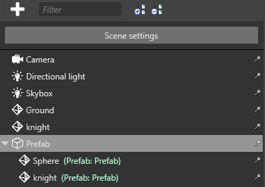
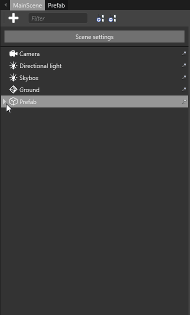

# Use prefabs
<span class="label label-doc-level">Intermediate</span>
<span class="label label-doc-audience">Programmer</span>
<span class="label label-doc-audience">Designer</span>

After you [create a prefab](create-prefabs.md), you can use it in the scene.

## Create a prefab instance

To instantiate a prefab, drag and drop it from the **Asset View** to the **Scene**.

You can re-arrange entities in the prefab instance just like you do with other entities:

* create child and parent entities
* drag entities to add them to the prefab instance
* drag entities from the prefab instance to make them independent entities

### Manage prefab parent entities

By default, Game Studio creates an empty parent entity with the prefab's entities as its children. The entity tree displays the prefab parent name in green next to the child entities.



This is useful because you can manage the prefab entities as a group and maintain their relative positions. For example, imagine you have a car prefab assembled from several entities (a body, seats, four wheels, etc). You probably want its component entities to stay grouped together as you move the car around the scene. You can do this by moving the prefab parent entity.

If you don't want to create a parent entity with the prefab, hold **Alt** when you drop the prefab into the scene. This is useful if you don't care about the relative positions of the prefab's entities and don't need to move them together as a group. For example, imagine you have a prefab composed of several crate entities arranged in a random fashion. It's not important that the crates maintain their relative position after you place them; in fact, several identical stacks of "randomly" arranged crates would look odd. In this situation, a parent entity is unnecessary. You can create several instances of the prefab, then re-arrange their individual crate entities however you like.

### Break link to prefab

After you add a prefab instance, you can break the link between the prefab and any of its child entities. This means the child entity is no longer affected by changes you make to the prefab.

To do this, in the **Scene Editor**, right-click a child entity or entities and select **Break link to prefab**.



## Example code

To use prefabs at runtime, you need to intantiate them. For example, if you have a prefab named _'MyBulletPrefab'_ in the root folder of your project, you can instantiate it with the following code:

```cs
private void InstantiateBulletPrefab()
{
    // Note that "MyBulletPrefab" refers to the name and location of your prefab Asset.
    var myBulletPrefab = Asset.Load<Prefab>("MyBulletPrefab");
    
    //Instantiate a prefab.
    var bullet = myBulletPrefab.Instantiate();

    // Add the bullet to the scene.
    SceneSystem.SceneInstance.Scene.Entities.AddRange(bullet); 

    // Change the X coordinate.
    bullet.Transform.Position.X = 20.0f;
    
    // Add the bullet to the scene.
    SceneSystem.SceneInstance.Scene.Entities.Add(bullet);
}
```

>[!Note]
>At runtime, changes made to prefabs (*myBulletPrefab* in the above example) don't affect existing prefab instances (*bullet* in the above example). Subsequent calls to ``Instantiate(Prefab)`` include the new changes.

>For example, imagine you have a tree prefab that contains a script to change the tree color from green to red at certain point at runtime. The script doesn't affect existing instances of the prefab; it can only change the color of **future** instances. This means prefabs instantiated after the code runs have the new color, but existing prefabs don't.

## See also
1. [Prefabs](prefabs.md)
2. [Create prefabs](create-prefabs.md)
3. [Manage prefabs](manage-prefabs.md)
4. [Modify prefabs](modify-prefabs.md)