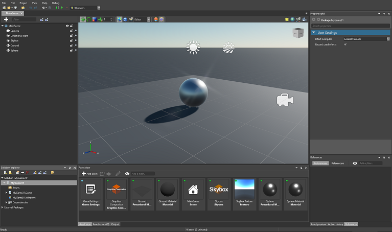

# Get started with Xenko

Beginner

This chapter explains everything you need to start using Xenko from scratch. 

## In this section

* [Install Xenko](install-xenko.md) - how to install Xenko
* [Launch Xenko](launch-Xenko.md) - how to launch Xenko for the first time
* [Create a project](create-a-project.md) - create your first project in Game Studio
* [Game Studio](../game-studio/index.md) - how to use Game Studio
* [Assets](../game-studio/assets.md) - getting started with assets
* [Introduction to scenes](../game-studio/scenes.md) - getting started with scenes
* [Launch your game](launch-a-game.md) - how to launch your game on different platforms