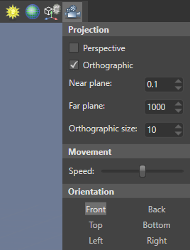
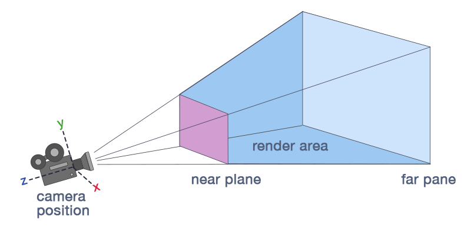

# Navigate in the scene editor

Beginner
Level Designer

You can move around the scene and change the perspective of the editor camera. The XYZ axes in the bottom left show your orientation in 3D space.

   

## Move around in the scene

There are several ways to move the editor camera around the scene editor. 

> [!TIP]
> Holding the **Shift** key speeds up movement.

### Walk

You can "walk" by holding the **left mouse button** and **moving the mouse**. This moves along the X and Z dimensions.

<video controls autoplay loop height="240" width="320">
                <source src="media/navigate-in-scene-walk-in-the-scene.mp4" type="video/mp4">
</video>

### Fly

To fly around the scene, hold the **right mouse button**, then **move the mouse** to change the camera direction and use the **WASD keys** to move. This is similar to the controls of many action games.

Action                          | Effect
--------------------------------|--------------
**Right mouse button + move mouse**              | Rotate editor camera
**A key + right mouse button**  | Move left
**D key + right mouse button**  | Move right
**S key + right mouse button**  | Move backward
**W key + right mouse button**  | Move forward
**Q key + right mouse button**  | Move down
**E key + right mouse button**  | Move up
 
<video controls autoplay loop height="240" width="320">
                <source src="media/navigate-in-scene-fly-in-the-scene.mp4" type="video/mp4">
</video>
 
### Rotate around a point

You can rotate around a center point by holding **Alt** and the **left mouse button** together and moving the **mouse**.

The point of rotation is always the center of the screen. You can adjust the distance to the center with the **mouse wheel**.

<video controls autoplay loop height="240" width="320">
                <source src="media/navigate-in-scene-orbital-rotation.mp4" type="video/mp4">
</video>
 
### Focus on an entity

After you select an entity, press the **F** key. This zooms in on the entity and centers it in the camera editor.

<video controls autoplay loop height="240" width="320">
                <source src="media/navigate-in-scene-focus-on-entity-using-f-key.mp4" type="video/mp4">
</video>

Alternatively, in the **entity tree**, click the  icon next to an entity. You don't have to select the entity first.

<video controls autoplay loop height="240" width="320">
                <source src="media/navigate-in-scene-focus-on-entity-using-magnifier-icon.mp4" type="video/mp4">
</video>

> [!TIP] 
> Focusing and then rotating with **Alt + left mouse button** is useful for inspecting entities.

### Controls

Action                 | Controls
-----------------------|--------------
Translate              | Arrow keys, any mouse button pressed + A, S, D, Q, W, and E keys
Walk                   | Left mouse button
Look around in a scene | Right mouse button
Orbital rotation       | Alt key + Left mouse button
Zoom in or zoom out    | Rotate mouse wheel, Alt key + Right mouse button
Pan                    | Press middle mouse button
Focus                  | Select an entity and press the F button

## Change camera editor perspective

You can change the camera editor perspective using the **view camera gizmo** in the top-right of the scene editor.

### Snap camera to position

To change the angle of the editor camera, click the corresponding face, edge, or corner of the **view camera gizmo**.

Click    | Camera position
---------|--------------
Face     | Faces the selected face
Edge     | Faces the two adjacent faces at a 45° angle
Corner   | Faces the three adjacent faces at a 45° angle

<video controls autoplay loop height="240" width="320">
                <source src="media/navigate-in-scene-change-view-angle.mp4" type="video/mp4">
</video>

## Camera options

To display the camera options, click the **camera icon** in the top-right of the scene editor.

### Perspective and orthographic view

**Perspective view** is a "real-world" perspective of the objects in your scene. In this view, lines of identical lengths appear different due to foreshortening, as in reality.

In **orthographic view**, lines of identical length appear the same length. Parallel lines never touch, and there's no vanishing point. It's easy to tell if objects are lined up exactly.

   

   

You can also switch between perspective and orthographic views by clicking the **view camera gizmo** as it faces you.

<video controls autoplay loop height="240" width="320">
              <source src="media/navigate-in-scene-switch-projection-mode.mp4" type="video/mp4">
</video>

#### Field of view

You can change the camera field of view. This changes the camera frustum, and has the effect of zooming in and out of the scene. At high settings (90 and above), the field of view creates stretched "fish-eye lens" views. The default setting is 45.

#### Near and far planes

The **near plane** is the point at which Game Studio begins rendering the scene. The default setting is 0.1.

The **far plane**, also known as the draw distance, is the opposite: the point beyond which Game Studio stops rendering the scene. The default setting is 1000.

Game Studio renders the area between the near and far planes.

## What's next?

* [Launch a game](launch-a-game.md)