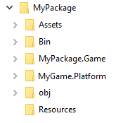

# Project structure

Xenko saves your projects as [Visual Studio solution files](https://msdn.microsoft.com/en-us/library/bb165951.aspx?f=255&MSPPError=-2147217396). You can open the projects with Xenko Game Studio or Visual Studio.

Xenko projects use many kinds of file, including source code, images, models, sounds, and others. The files fall into one of two categories:

*	**Source code** (files used by programmers)

*	**Asset** (.xk*) (files used by non-programmers, eg designers and artists)

**Assets** are the content of your game. They're usually created from files created with other software, such as image files (.jpg, .png etc), 3D models (.fbx etc), sounds (.mp3, .wav etc), and so on. For example, texture assets use image files, and audio assets use audio files. Files such as these, used by assets, are called **resource files**.

## Packages

Xenko organizes the project into **packages**, .xkpkg files contained in dedicated folders. A project can contain one package or several. You can share packages between projects.

Packages have the following directory structure:

* **Assets** contains the asset files which represent elements in your game. For more information, see [Introduction to assets](assets.md).

* **Bin** contains the compiled binaries and data. Xenko creates the folder when you build the project, with a subdirectory for each platform.

* **MyPackage.Game** contains your source code.

*	**MyPackage.Platform** contains additional code for the platforms your project supports. Game Studio creates folders for each platform (eg *MyPackage.Windows*, *MyPackage.Linux*, etc). These folders are usually small, and only contain the entry point of the program.

* **obj** contains cached files. Game Studio creates this folder when you build your project. To force a complete asset and code rebuild, delete this folder and build the project again.

* **Resources** is a suggested location for files such as images and audio files used by your assets. You can put these files wherever you want - in a specific folder such as the Resources folder, or alongside the asset files that use them (in the Assets folder).

## Organize your files

It's a good idea to organize your files as soon as you start using Xenko.

Whether you’re working alone or in a team, we recommend you use a version control system such as Git, SVN, or Perforce Helix to save a history of changes to your project.

>![NOTE]
> We don't recommend you add the **Bin** or **obj** folders to version control. They take up lots of space and almost any change on your project will need to rebuild them.

>![NOTE]
>Visual Studio puts additional **.obj** folders inside each code folder. We don't recommend you add these to version control.

>![NOTE]
>We don't recommend you save files created with external tools, such as .psd files (Photoshop) or .max files (3D Studio Max), in your project folder. These files are often very large and aren't necessary to build your game. Instead, save them in a different version control repository - or, if your version control system supports partial checkouts (such as SVN or Perforce), save them in a different root folder. This means team members only get the files they need.

### Where to save resource files

You can save resource files in the Resources folder, or put them somewhere else.

For example, you can save your resource files in the Asset folder alongside your asset files. You might be used to organizing files this way if you use Unity, as Unity requires resource files and asset files to be in the same folder.

However, this can create problems in some situations. For example, imagine a designer needs to edit an asset quickly. To do this, they need to get the latest version of the asset from source control. At the same time, a 2D artist has edited 10GB of textures and committed them to source control. As these files are in the same folder, the designer is forced to get the 10gb of texture changes in order to work on the asset. On the other hand, if the texture files are in a separate folder, the designer can do a partial sync and ignore the texture changes, which they don't need right now.

Ultimately, how you organize your files is up to you, your teammates, and your version control system.

## Example

Imagine a team with two programmers, two 2D artists, and two 3D artists. The programmers check out the project folder (containing code, assets, and resources). The 2D artists check out the game project and an additional, separate folder containing .psd files. The 3D artists check out the game project and an additional, separate folder containing .fbx (Maya) files.

Now imagine one of the 2D artists changes several .psd files and commits 2GB of changes to version control. Because only the 2D artists have the folder checked out, only the other 2D artist gets this change. The other people don't need to know about it.

----

•	File exported from external tools and imported by Xenko assets, such as FBX files from Maya, png from Photoshop, etc. should be stored in a folder inside your project root folder. Ideally it is better to create a Resources folder as in the example in the first section of this doc, and not mixing them with the content of the Assets folder, because these resource files also tend to be huge, comparing to asset (xk*) files that remain small.
o	It’s easier to handle in version control: for example if you use Git with the LFS extension, you can easily flag all the content the Resources folder to be considered as large files.
o	It will be easier to copy, transfer, synchronize… asset files when you know that you don’t need the latest version of the resource files.

