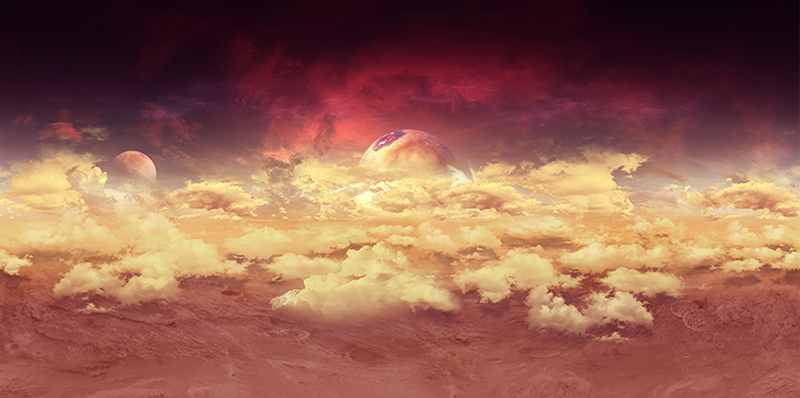
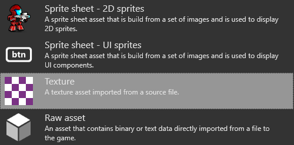
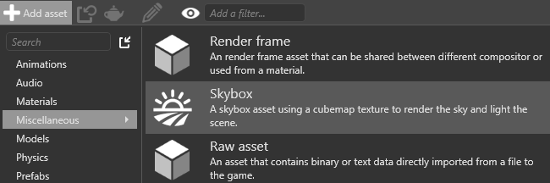
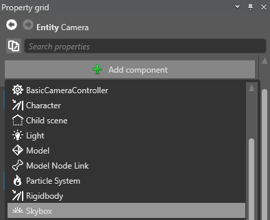
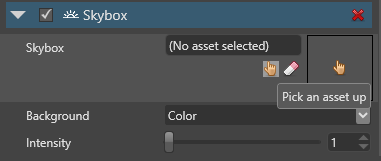

# Skyboxes
<span class="label label-doc-level">Beginner</span>
<span class="label label-doc-audience">Designer</span>
<span class="label label-doc-audience">Programmer</span>

**Skyboxes** are backgrounds that create the illusion of space and distance. Typical skybox backgrounds include skies, clouds, mountains, and other scenery.

To create a skybox, Xenko encloses the scene in a cube and maps a texture, called a **cubemap**, on the cube's inner faces. This simulates three-dimensional surroundings that appear spacious. Skyboxes are pre-rendered, so require little GPU and CPU. You can also use skyboxes to light a scene.




> [!Note]
> Currently, Xenko doesn't support skydomes.

## Cubemaps

Cubemaps are composed of six images, one for each face of the skybox cube. Xenko uses cubemaps with the extension `.dds`.

> [!Note]
> Currently, Game Studio can't convert image files to `.dds` files for you.
> Use another application to create a cubemap from separate image files, such as:
> * [Nvidia conversion tool](https://developer.nvidia.com/nvidia-texture-tools-adobe-photoshop)
> * [ATI conversion tool](http://developer.amd.com/tools-and-sdks/archive/games-cgi/cubemapgen)

### Add a cubemap asset to a project

* In the **Asset view**, click , select **Textures** > **Texture**, and browse to the `.dds` file.

    

* Alternatively, drag and drop a `.dds` file from **Windows Explorer** to the **Asset view**, then select **Texture**.

    

The cubemap is now available as an asset in your project. You can use the cubemap asset in your skybox asset.

## Add a skybox asset to a project

1. In the **Asset view**, click 
2. Select **Miscellaneous**, and choose **Skybox**.

    

    The **Asset picker** opens.

3. Choose a skybox texture from your project assets and click **OK**.
    
    

In the skybox asset properties, under **Usage**, you can select whether to use the skybox to light your scene.

* **Lighting and background** (default): The skybox is used for both lighting and background.
* **Lighting**: The skybox is only used to light the scene, and isn't visible at runtime.
* **Background**: The skybox is only used as a background image, with no lighting.

## Add a skybox component to an entity

Xenko includes a skybox entity in the project by default. Only one skybox can be active in a scene at a time. If there are multiple skyboxes in the scene, Xenko loads the first. 

You can create more than one skybox by adding [skybox components](xref:SiliconStudio.Xenko.Engine.SkyboxComponent) to as many entities as you need. You might want to include more than one skybox, for example, if you want to script the skybox to change.

To add a skybox component:

1. In the **Scene view**, select the entity you want to add the skybox component to. 

    This can be an empty entity. Its position in the scene doesn't matter.

2. In the **Property grid**, click **Add component** and select **Skybox component**.

    

3. Specify the **skybox asset** you want to use.

    

You can change the following settings of the skybox component:

* specify how to display skybox in the background
* set the background radiation intensity of the skybox from 0 (none) to 100 (maximum)

## Example code

```cs
public Skybox skybox;
public void ChangeSkyboxParameters()
{
    //Add skybox component to entity.
    var skyboxComponent = Entity.Get<SkyboxComponent>();

    //Replace existing skybox.
    skyboxComponent.Skybox = skybox;
    
    //Change light intensity of the skybox.
    skyboxComponent.Intensity = 1.5f;

    //Change skybox background mode.
    skyboxComponent.Background = SkyboxBackground.Irradiance;

    //Change skybox background color.
    skyboxComponent.Background = SkyboxBackground.Color;
}
```