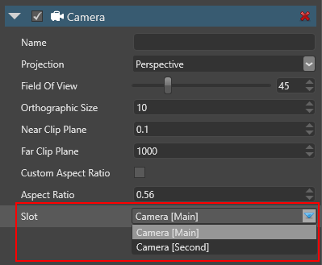

# Camera slots

**Camera slots** link the graphics compositor to the cameras in your scene. You bind each camera to a slot, then define which slot the compositor uses. This means you can change the [root scene](../../game-studio/manage-scenes.md) or [graphics compositor](index.md) without having to assign new cameras each time.

You don't have to create a different camera slot for each camera. Instead, you can just change which cameras use each slot. The best practice is to disable the camera components on cameras you don't need.

> [!Note]
> Each camera slot must have a camera assigned to it. If you have an unused camera slot, delete it.
>
> You can't assign a single camera to more than one slot. If you need to do this, duplicate the camera entity and assign it to a different slot.

> If multiple enabled cameras in your scene use the same camera slot, the result is undefined.

## Create a camera slot

In the graphics compositor editor, on the left, under **Camera slots**, click  (**Add a new item to the list**).


> [!Tip]
> To name a camera slot, double-click it in the list and type a new name.

## Bind a camera to a camera slot

1. In your scene, select the **entity** with the camera component you want to bind.

2. In the **property grid** (on the right by default), in the **Camera** component properties, under **Slot**, select the slot you want to bind the camera to.

    > [!Note]
    > The drop-down menu lists camera slots from the graphics compositor selected in the [game settings](../../game-studio/game-settings.md).

    

The graphics compositor matches enabled cameras to their appropriate slots each frame.

## Create a camera and assign a camera slot from a script

Use:

```cs
var camera = new CameraComponent();
 camera.Slot = SceneSystem.GraphicsCompositor.Cameras[0].ToSlotId();
```

> [!Note]
> Make sure you:
>
> * always have at least one enabled camera
>
> * don't have two cameras enabled and assigned to the same slot at the same time 

## See also

* [Graphics compositor](index.md)
* [Game Studio - Game settings](../../game-studio/game-settings.md)
* [Game Studio - Manage scenes](../../game-studio/manage-scenes.md)