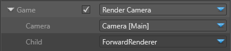

# Graphics compositor

Advanced
Programmer

>[!Note]
>This page requires a basic understanding of graphics pipelines.

The **graphics compositor** organizes how a [scene](../../game-studio/scenes.md) is rendered. You can use it to customize almost every part of the rendering pipeline. For example, you can:

- use one or multiple cameras
- filter entities in the scene
- render to one or more render targets, with different viewports
- render a scene with a camera to a render target used as the input texture of a Material/Effect in a scene (eg render the rear-view mirror point-of-view to a texture, and display it on the rear-view mirror model)
- mix the rendering mode at the same time in the same graphics composition
- mix HDR and LDR rendering
- apply ImagePostProcessing Effects on a render target, selected before/after rendering a camera
- clear a render target or clear only the depth buffer (eg to always render on top of a render target in a FPS game, or render the UI)
- manipulate the compositor from scripts (or any animation system) in the scene to modify the composition, enable effects, etc

## Create a graphics compositor

When you create a project, Xenko includes a graphics compositor by default.

## Set the graphics compositor

You can have multiple graphics compositors in your project, but you can only use one compositor at a time. At runtime, Xenko uses the graphics compositor you specify in [Game Settings](../../game-studio/game-settings.md).

## Open the graphics compositor editor

>[!Note]
>The graphics compositor editor is a work in progress, and a little unstable. It will be improved in future Xenko versions.

In the **asset view** (in the bottom pane by default), double-click the **Graphics Compositor** asset.

The Graphics Compositor editor opens.

## Entry points

In the **Entry Points** node, you set up the entry points for your rendering pipeline. There are three entry points: **Game**, **SingleView**, and **Editor**.

| Entry point | Description 
|-------------|------------
| Game        | The entry point from your game. You must have at least one camera in your scene
| SingleView  |                     
| Editor      | Entry point for the Scene Editor in Game Studio

#### Add a step

Next to **Game**, in the drop-down menu, select where you want to send the output from your game.

The Entry Points node adds a *Child* after the *Game*.

1. Under **Child**, select the renderer you want to send the entry point to.

... add a camera slot...

2. Set the properties of the renderer. For more details about each renderer, see...

You can repeat steps 1 and 2 to add as many steps as you need. To remove a step, select **None** from the drop-down menu. 

>[!Note]
>When you remove a step, you also remove its child steps.

## Forward Renderer

The **Forward Renderer** node controls the additional effects applied to the inputs. 

## Render stage

Render stages define ways to render given objects (usually with their associated effects/shaders). They also offer ways to control advanced properties such as sorting and filtering of those objects. For more information, see [Render stage](../rendering-pipeline/render-stage.md).

## Render features

Render features prepare, collect, and draw all the data associated with types of objects which can be rendered (eg meshes, visual effects, debug shapes, sprites, etc). The render feature collects the correct vertex buffers, sets the materials, and invokes the draw calls.

### Render stage selectors

Render stage selectors define which objects in your scene are sent to which render stage, and choose which [effect](../effects-and-shaders/effect-language.md) to use when rendering a given object.

For example, this is the typical setup for meshes:

- @'SiliconStudio.Xenko.Rendering.MeshTransparentRenderStageSelector' chooses either the `Main` or `Transparent` render stage, depending on the material properties. The default effect is `XenkoForwardShadingEffect` defined by Xenko (you can create your own if you want).
- @'SiliconStudio.Xenko.Rendering.ShadowMapRenderStageSelector' selects opaqe meshes that cast shadows and adds them to the `ShadowMapCaster` render stage. The default effect is `XenkoForwardShadingEffect.ShadowMapCaster`, defined by Xenko.

Either can filter by render group.

You can customize everything, so you can add other predefined render stage selectors (eg to add UI to a later full-screen pass), or create your own selector specific to your game.

### Pipeline processors

Pipeline processors are classes called when creating the [pipeline state](../low-level-api/pipeline-state.md). This lets you do things such as enable alpha blending or wireframe rendering on a specific render stage.

Xenko includes several predefined pipeline processors. You can also create your own.

## Renderers

Renderers define a specific rendering action. Xenko includes several renderers:

- [Clear](scene-renderers/clear.md)
- [Render Camera](scene-renderers/render-camera.md)
- [Render Effect](scene-renderers/render-effect.md)

### Render Camera

Create and set up a [render view](../rendering-pipeline/index.md#render-views) using a camera slot. It renders using @'SiliconStudio.Xenko.Rendering.Compositing.SceneCameraRenderer.Child'.

## Properties

| Property      | Description
| ------------- | -------------
| Child         | Select a renderer for this camera, such as ForwardRenderer or any of your custom renderers  
| Camera        | Specify a Camera slot defined at the level of the Scene Graphics Compositor