# Render to a texture

Intermediate
Designer
Programmer

You can render to textures in your scene instead of directly to the screen. For example, you can use this to display part of your scene on a TV screen in the same scene, such as security camera footage.

For API details, see [Textures and render targets](../low-level-api/textures-and-render-targets.md).

## 1. Create a camera slot

Camera slots link the graphics compositor to the cameras in your scene. You need to add a camera slot for your new camera to use.

For more information, see [Camera slots](camera-slots.md).

1. In the **asset view** (in the bottom pane by default), double-click the **Graphics Compositor** asset.

    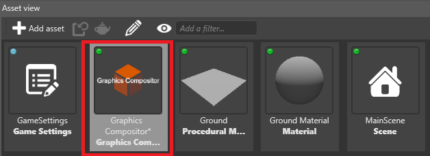

    The graphics compositor editor opens.

    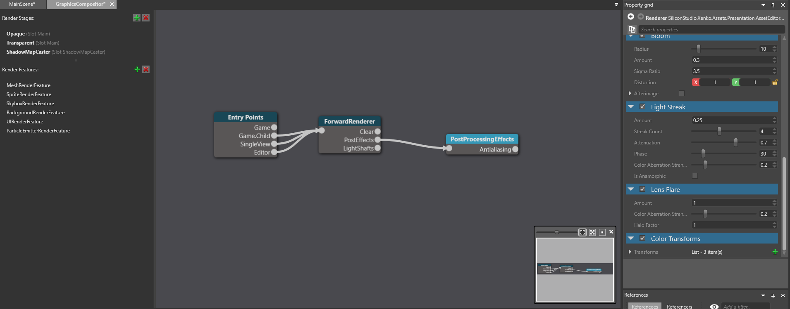

2. On the left, under **Camera slots**, click  (**Add a new item to the list**) to create a camera slot.

    

    > [!Tip]
    > To name a camera slot, double-click it in the list and type a new name.

## 2. Create a camera and bind it to the slot

1. In your scene, add a camera component to the entity you want to be your camera.

    

2. Position the entity so the camera captures the area of the scene you want to render to a texture.

3. In the **property grid** (on the right by default), enable the **Camera** component using the checkbox.

    

4. in the **Camera** component properties, under **Slot**, select the slot you created in the previous step.

    

## 3. Create a render target texture

The render target texture displays the camera output.

In the **asset view**, click **Add asset** and select **Texture** > **Render target**.

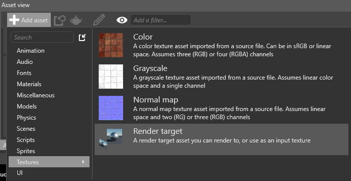

Game Studio adds a **render target** texture to your project assets.

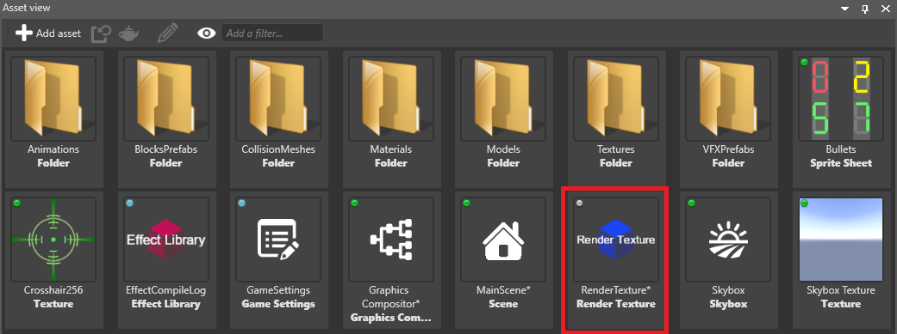 

## 4. Place the render target texture in the scene

There are various ways you can use the render target texture.

### Example 1: Use the render target texture in a material

1. In the material properties, under **Shading**, next to **Diffuse map**, click  (**Create a new instance with the selected type**) and select **Texture**.

    

2. Click  (**Pick an asset up**) to open the asset picker.

3. In the asset picker, select the **Render texture** asset and click **OK**.

    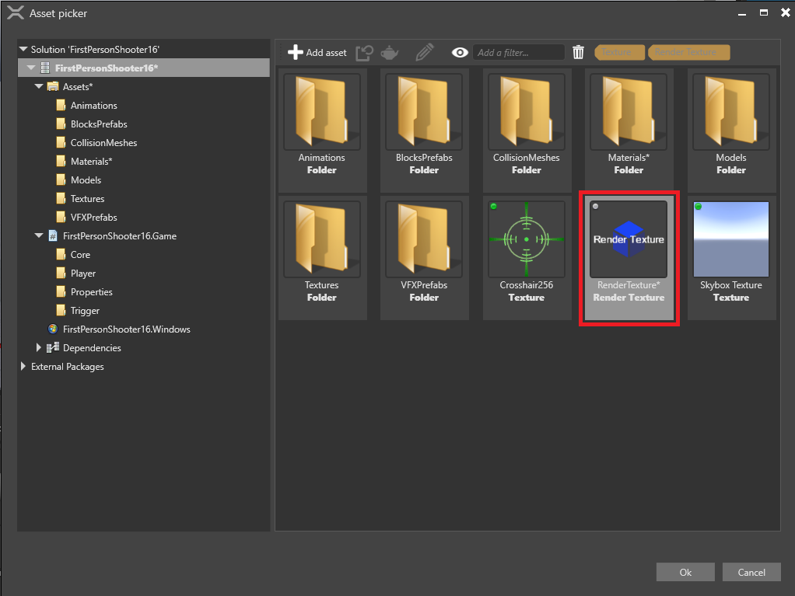

### Example 2: Use the render target texture in a sprite component

1. Create an entity and position it where you want to display the texture.

2. With the entity selected, in the **Property grid**, click **Add component** and add a **sprite** component.

    

3. In the sprite component properties, next to **Source**, click  (**Create a new instance with the selected type**) and select **Texture**.

    

4. Click  (**Pick an asset up**) to open the asset picker.

5. In the asset picker, select the **Render texture** asset and click **OK**.

    

6. If you don't want the texture to be semi-transparent, under the **Source** properties, clear the **Is transparent** checkbox.

    

## 5. Set up the graphics compositor

To display a render texture in your scene, you need at least two renderers:

* one to render your main camera
* one to render the second camera to the render texture

This page describes the simplest way to do this from scratch, using two cameras and two renderers. Depending on your pipeline, you might need to create a different setup.

> [!Warning]
> These instructions involve deleting your existing renderers for the game entry point. You might want to make a backup of your project in case you want to restore your pipeline afterwards.

1. In the graphics compositor, select the **Entry points** node.

    

2. In the **property grid** on the right, next to **Game renderer**, click  (**Create a new instance with the selected type**) and select **None** to delete your existing renderers.

    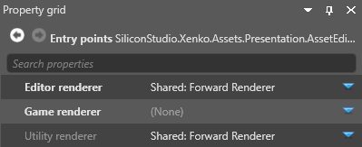

3. Click  (**Create a new instance with the selected type**) and select **Scene renderer collection**.

    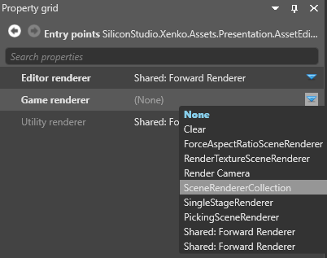

    This lets you set multiple renderers for the game entry point.

### 1. Render the texture

1. Under **Game renderer**, next to **Children**, click  (**Add a new item to the list**) and select **Render camera**.

    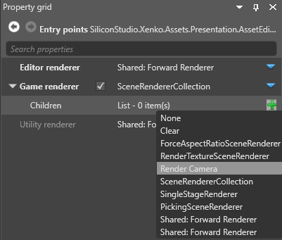

2. Next to **Camera**, click  (**Create a new instance with the selected type**) and select the camera you want to render to a texture.

    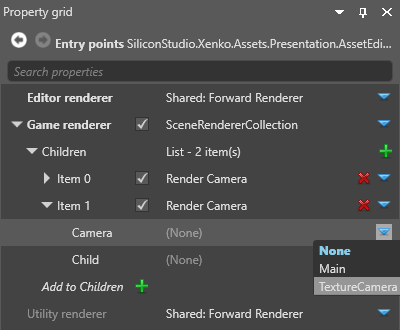

3. Next to **Child**, click  (**Create a new instance with the selected type**) and select **RenderTextureSceneRenderer**.

    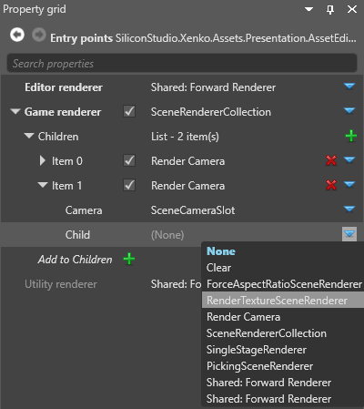

4. Under the **RenderTextureSceneRenderer**, next to **Child**, click  (**Create a new instance with the selected type**) and select renderer for your main game camera (eg the **forward renderer**).

    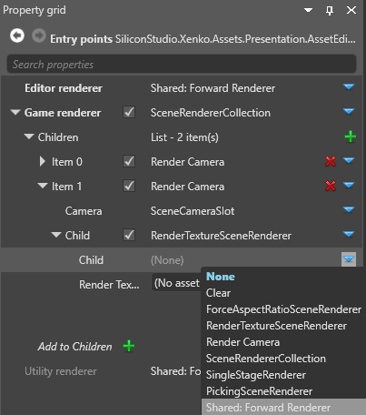

5. Next to **Render Texture**, click  (**Pick an asset up**):

6. Select the **render texture** and click **OK**.

    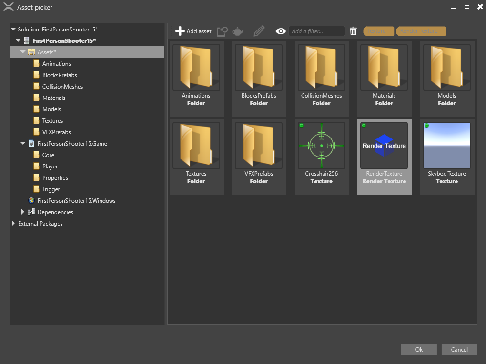

    Game Studio adds the render texture to the renderer.

    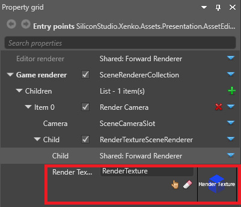

### 2. Render the main camera

1. Under **Game renderer**, next to **Children**, click  (**Add a new item to the list**) and select **Render camera**.

    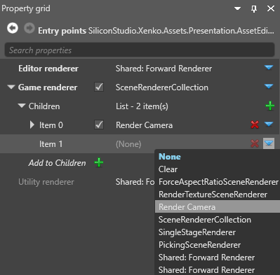

2. Under **Children**, expand the second **Render camera** in the list.

    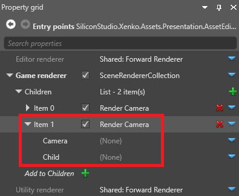

2. Next to **Camera**, click  (**Create a new instance with the selected type**) and select your main game camera (not the camera you want to render to a texture from).

    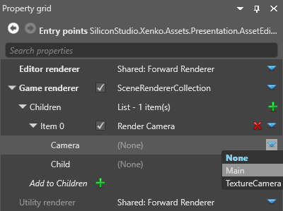

4. Next to **Child**, select the renderer for your main game camera (eg the **forward renderer**).

    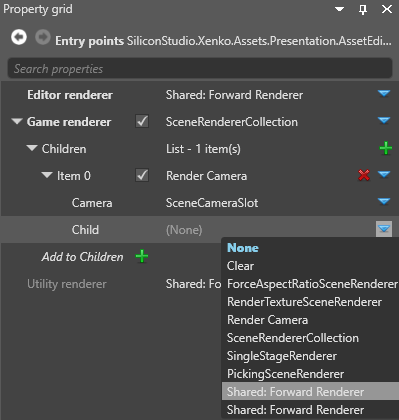

    Your final game renderer properties should look like this:

    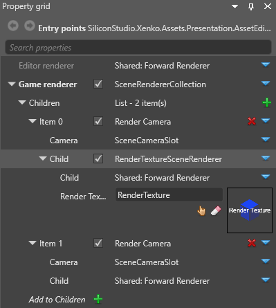

Your game is now ready to render the camera to the texture in the scene.

## Sample

For an example of rendering to a camera in a project, see the **Animation** sample included with Xenko.

## See also

* [Low-level API - textures and render targets](../low-level-api/textures-and-render-targets.md)
* [Graphics compositor](index.md)
* [Scene renderers](scene-renderers.md)
* [Camera slots](media/graphics-compositor-camera-slots.png)