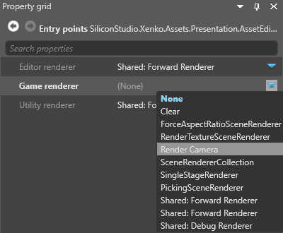
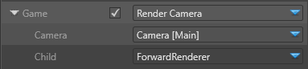

# Scene renderers

**Scene renderers** let you customize the **collect** and **Draw** phases of the rendering. For more information about these stages, see [Render features](../rendering-pipeline/render-features.md). 

You select scene renderers in the **entry points** node properties.

For more information about selecting renderers, see the [Graphics compositor](index.md) page.

## Clear

Clears a frame, with a solid color.

### Properties

| Property      | Description              
| ------------- | ----------
| Clear flags   |  What to clear in the render frame (**Color only**, **Depth only**, or **Color and depth**)
| Color         | The color used to clear the color texture of the render frame. Only valid when **Clear Flags** is set to **Color** or **Color and depth**
| Depth value   | The depth value used to clear the depth texture of the render frame
| Stencil value | The stencil value used to clear the stencil texture of the render frame

## Render camera

Uses @'SiliconStudio.Xenko.Rendering.Compositing.SceneCameraRenderer.Child' to render a view from a [camera slot](camera-slots.md). In simple terms, the **render camera** renderer takes the input from a camera in the scene so it can be displayed somewhere.

### Properties

| Property      | Description                                                             
| ------------- | ----------
| Camera        | Specify a [camera slot](camera-slots.md) to render from
| Child         | Specify a renderer for the camera (eg a forward renderer or a custom renderer)

## Scene renderer collection

The **scene renderer collection** executes multiple renderers (eg render camera, render texture, etc) in sequence. In simple terms, this lets you set multiple renderers for an entry point. You can add as many renderers to the collection as you need.

>[!Note]
>Xenko executes the renderers in list order.

To add a renderer to the collection, next to **Children**, click  (**Add a new item to the list**) and select the renderer you want to add.

## Forward renderer

In a typical setup, the **forward renderer** renders almost everything in your scene. It renders, in order:

1. opaque objects
2. transparent objects
3. [post effects](../post-effects/index.md)

The forward renderer is also where you set VR options. For more information, see [Virtual reality](../../virtual-reality/index.md). 

You configure the forward renderer properties in the **forward entry node**. 

## Single stage renderer

## Force aspect ratio scene renderer

Uses @'SiliconStudio.Xenko.Rendering.Compositing.ForceAspectRatioSceneRenderer' to force an aspect ratio and applies a letterbox if the ratio is different from the screen. Use this before the **render camera**.

| Property      | Description                                                             
| ------------- | ----------
| Child         | Specify a renderer for the camera (eg a forward renderer or a custom renderer)
| Fixed aspect ratio | The aspect ratio to force the view to
| Force aspect ratio | Enable forced aspect ratio

## Render texture

Renders to a render texture, which you can display in your scene (eg to create security camera footage on a screen). For more information, see [Render to a texture](render-to-a-texture.md).

| Property      | Description                                                             
| ------------- | ----------
| Child         | Specify a renderer for the camera (eg a forward renderer or a custom renderer)
| Render texture| Specify a texture to render to

## See also

* [Graphics compositor](index.md)
* [Camera slots](camera-slots.md)