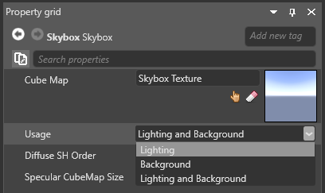
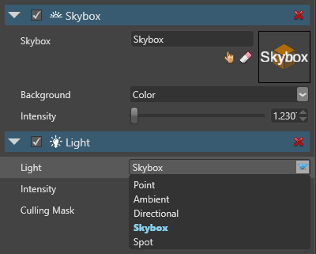

# Skybox lights
Beginner
Designer
Programmer

A skybox light is an [ambient light](ambient-lights.md) emitted by a [skybox](../skyboxes.md).  Xenko analyzes the skybox cubemap and generates lighting using [image-based lighting (Wikipedia)](https://en.wikipedia.org/wiki/Image-based_lighting).

 

To use a skybox light, an entity must have both:

* a [Light component](xref:SiliconStudio.Xenko.Engine.LightComponent) of type **Skybox**
* a [Skybox component](xref:SiliconStudio.Xenko.Engine.SkyboxComponent)

These images show the difference between ambient and skybox lighting on two pure diffuse [materials](../materials/index.md):

| Ambient lighting                                     | Skybox lighting     
| ---------------------------------------------------- | -------------------------------
|   |   |                                                           |                        
These images show the effect of skybox lighting on different materials:

| Material Plastic    | Metal 100% Gloss 50%                                                                                    | Metal 100% Gloss 100%                                                                                      |
----------------------------------------------------------- | ---------------------------------------------------------------------------------- | -------------------------------------------------------------------------------------------------- | ---------------------------------------------------------------------------------------------------- |
   |   |   |

# Set up a skybox light

To follow these instructions, you need a skybox asset and an entity with a skybox component. For information about how to add them, see the [Skybox](../skyboxes.md) page.

1. Select the skybox asset.

2. In the asset **Properties grid**, under **Usage**, you can choose whether the skybox is used for lighting, a background image, or both:

    

    * **Lighting and Background** (default): The skybox is used for both lighting and the background.
    * **Lighting**: The skybox is only used for lighting, and isn't visible at runtime.
    * **Background**: The skybox is only used as a background image, with no lighting.

    If you want the skybox to be visible at runtime, select **Lighting and Background**. If you only want to use it for lighting, choose **Lighting**.

    > [!Note]
    > If the Skybox component is disabled, Xenko only uses it for lighting. It doesn't display the skybox background.

3. Select the entity that has the [Skybox component](xref:SiliconStudio.Xenko.Engine.SkyboxComponent).

4. In the entity **Properties grid**, click **Add component** and select [Light](xref:SiliconStudio.Xenko.Engine.LightComponent).

    

5. In the **Light** component properties, under **Usage**, select **Skybox**.

    

The [Light componenet](xref:SiliconStudio.Xenko.Engine.LightComponent) uses the skybox asset to light the scene.

# Skybox light properties

 

| Property     | Description                                                                                                                                                                                    |
| ------------ | ---------------------------------------------------------------------------------------------------------------------------------------------------------------------------------------------- |
| Type         | Skybox                                                                                                                                                                                         |
| Intensity    | The light intensity. The value has no units, as it is dependent on the Skybox component values (see the note below). |
| Culling Mask | Defines which entity groups are affected by the light. By default, all groups are affected.                                                                                                   |

>[!Note]
>The **Intensity** properties in the Skybox and Light components are linked. To calculate the Light component [intensity](xref:SiliconStudio.Xenko.Engine.LightComponent.Intensity), Xenko multiplies it by the Skybox component [intensity](xref:SiliconStudio.Xenko.Engine.SkyboxComponent.Intensity). The final color is defined as: `final Color = Skybox Sampler Color * Light Skybox Intensity * Skybox Intensity`

## See also

* [Skyboxes](../skyboxes.md)
