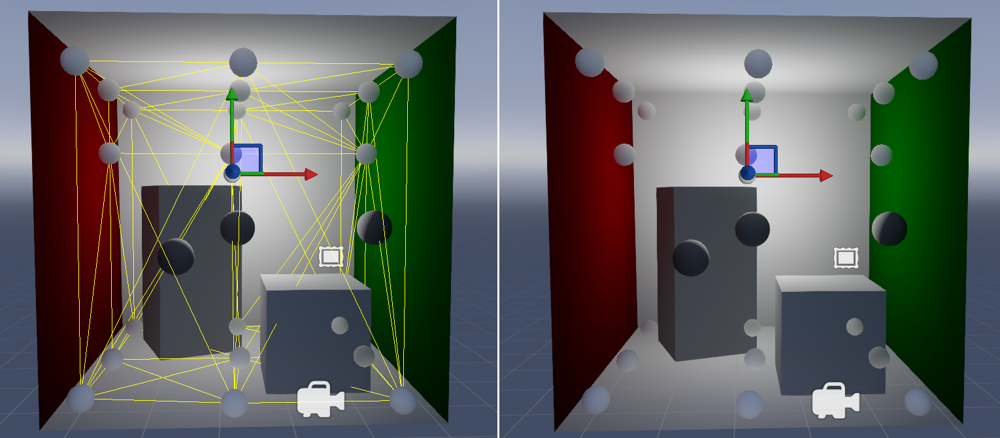

## Light probes

**Light probes** sample areas of lighting in your scene. Xenko then interpolates the lighting between the samples taken by light probes.

**Light probes** are a cheap way to simulate the effect of light bouncing off surfaces and illuminating other surfaces...

Light probes can make a dramatic difference to the appearance and mood of your scene.

Light probes form 

## 1. Create a light probe

Right-click the scene or entity tree and select **Light > Light probe**.

Alternatively, create an empty entity and add a **Light probe component** in the property grid. 

Game Studio adds a light probe to the scene. They appear as spheres.

When you first add a light probe, it has a completely black surface.

They appear as white spheres.

>[!Tip]
>Like other entities, to quickly duplicate a light probe, select it, hold Ctrl, and move it with the mouse.

## 2. Place light probes

You position light probes using the transform component, just like any other entity.

Light probes must be placed in a way that creates a **3D volume**. This means:

* you need at least four light probes in the scene (enough to create a tetrahedron, a pyramid shape)

* you can't place them on a single (ie 2D) plane. For example, the probes in this screenshot won't work, as they are on a flat plane and create no volume:

    

To preserve CPU, we recommend you use as few light probes as possible, positioning them to create maximum effect with the minimum number of probes.

Generally, you should place light probes where the lighting in your scene changes abruptly such as at the edges of shadowy areas or between areas of different color. You usually don't need light probes in areas without major lighting changes, such as across dark areas.

## 3. Capture light bounces

Before you capture a light bounce for the the first time, the light probes have a completely black surface.

light-probes-black.png

After you place your light probes, in the scene editor toolbar, click the **new light bounce** button. This:

* clears any existing light bounce data in the light probes

* generates a new light bounce

If you change the light sources in your scene, click **new light bounce** again to remove the old lighting and capture the new lighting.

After you create your first light bounce, click the **generate additional light bounce** button.

You can see the effect of the light bounces on the surface of the light probes. The following screenshots show the result of bouncing lights with the central point light in different positions.

In the screenshot below, the point light is near the floor. Notice how the red color from the wall is reflected on the gray object and the white floor. This is also shown on the light probe surface.

In the screenshot below, the point light is near the ceiling, so there's much less light to bounce. Much less red light is bounced between the surfaces, although there's still some.

This bounces the light again, simulating the effect of light bouncing back and forth between surfaces and building an increasingly realistic capture around the light probe. You can click the bounce button as many times as you want without slowing performance. However, this has diminishing returns; after a few bounces, the changes become unnoticeable. Five bounces should be sufficient to capture all the light.

## Show and hide light probes

To change the visibility of the light probes, under the **gizmo options** in the scene editor toolbar, use the **Light probes** checkbox.

## Show and hide light probe grid

To change the visibility of the light probe grid, under the gizmo options in the scene editor toolbar, use the **Light probe grid** checkbox.

## Where to place light probes

To preserve CPU, you should use as few light probes as possible, positioning them to create maximum effect with the minimum number of probes.

Generally, you should place light probes where the lighting in your scene changes abruptly, such as at the edges of shadowy areas or between areas of different color. You usually don't need light probes in areas without major lighting changes, such as across dark areas.