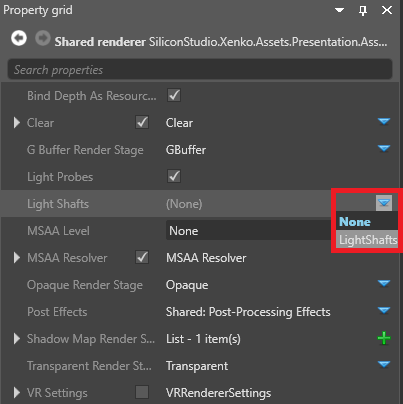
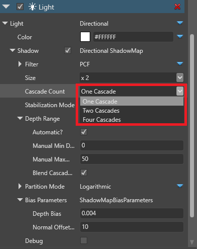
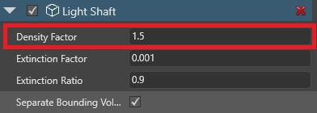
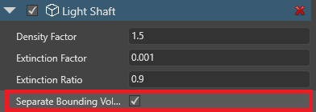

# Light shafts

Beginner
Designer
Artist

**Light shafts**, also called **god rays**, are visible rays originating from a [directional light](directional-lights.md). 

<video autoplay loop class="responsive-video" poster="media/lightshaft_CoS_640.jpg">
   <source src="media/lightshaft_CoS_640.mp4" type="video/mp4">
</video>

Xenko light shafts are based on [shadow maps](shadows.md) and use raymarching rather than post effects, so they're visible even when the light source isn't.

<video autoplay loop class="responsive-video" poster="media/lightshaft_640.jpg">
   <source src="media/lightshaft_640.mp4" type="video/mp4">
</video>

To create light shafts, use three components together: **lights**, **light shafts**, and **light shaft bounding volumes**.

## 1. Enable light shafts in the graphics compositor

Xenko disables light shafts by default in new projects. To enable them:

1. In the **asset view** (in the bottom pane by default), double-click the **Graphics Compositor** asset.

    

    The graphics compositor editor opens.

    

2. Select the **forward renderer** node.

3. In the **property grid** (on the right by default), next to **Light shafts**, click  (**Create a new instance with the selected type**) and select **LightShafts**.

    

For more information about the graphics compositor, see the [Graphics compositor](../graphics-compositor/index.md) page.

## 2. Add a light shaft component

1. In your scene, select the entity with the **directional light** you want to create light shafts.

    For more information about how to use directional lights, including how to add them, see [directional lights](directional-lights.md).

2. In the **property grid**, in the **Light** component properties, make sure the **Shadow** checkbox is selected.

    

3. Expand **Shadow** and set the **cascade count** to **one cascade**.

    

    > [!Note]
    > Currently, light shafts are only implemented for directional lights with one cascade. You'll be able to use multiple cascades in future versions. For more information about cascades, see the [Directional lights](directional-lights.md) page.

4. Click **Add component** and select **Light shaft**.

    

    Game Studio adds a light shaft component to the entity.

## 3. Add a bounding volume

The **light shaft bounding volume** defines the area in which light shafts are created. You can add the bounding volume to the same entity that has the directional light, but it's usually simpler to add it to a separate entity.

1. In the **asset view**, click **Add asset**. 

2. Under **Models**, select a model in the shape you want the volume to be. For example, if you use a cube, light shafts will be created in a cube-shaped area.

    

    The **asset picker** opens.

    

3. You don't need a material for the model, so click **Cancel** to create a model without a material.

4. In the scene, create an empty **entity**. For now, it doesn't matter where you put it; you can reposition it later.

5. With the entity selected, in the **property grid**, click **Add component** and select **light shaft bounding volume**.

    

6. In the **light shaft bounding volume** component properties, next to **light shaft**, click  (**Pick an asset up**).

7. In the **entity picker**, select the entity with the directional light you want to create light shafts and click **OK**.

8. In the **light shaft bounding volume** component properties, next to **Model**, click  (**Pick an asset up**).

9. In the **asset picker**, select the model you created and click **OK**.

    

    This model defines the shape of the light shaft bounding volume.

10. Using the **transform** component, position and scale the entity to cover the area where you want to create light shafts.

### 4. Optional: Use a model as a bounding volume guide

Currently, Game Studio doesn't display the bounding volume in the scene editor. This will change in future versions. 

As a workaround, you can add a model component to use as a guide.

1. On the entity with the light shaft bounding volume component, click **Add component** and select **Model**.

    

2. Under the **Model** component properties, next to **Model**, click  (**Pick an asset up**).

3. In the **asset picker**, select the model you created earlier and click **OK**.

    

4. Under **Materials**, clear the **Cast shadows** checkbox. This stops your model blocking light shafts.

    

5. After you place the bounding volume, disable or remove the model component to hide it at runtime.

## Optimize light shafts

Light shafts work best in dark environments. You can adjust the directional light and light shaft component properties to achieve different results - for example, by changing the directional light color (in the **light component properties**) or the light shaft density (in the **light shaft component properties**).

Multiple light shafts viewed through one another can become visually noisy, as in the image below:

To reduce this effect, in the **light shaft component properties**, reduce the **density factor**.

Alternatively, use multiple bounding volumes. To do this:

1. Create additional bounding volume(s) and position them to cover the area where you want to create light shafts. Make sure the bounding volumes don't overlap (light shafts in overlapping areas are extra-bright).

2. In the **light shaft component properties**, make sure **separate bounding volumes** is enabled.

This calculates the light shafts in each bounding volume separately, lessening visual noise.

>[!Note]
>Using multiple bounding volumes uses more processing power.

## See also

* [Directional lights](directional-lights.md)
* [Shadows](shadows.md)
* [Graphics compositor](../graphics-compositor/index.md)