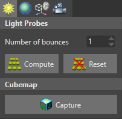

# Skyboxes

<span class="label label-doc-level">Beginner</span>
<span class="label label-doc-audience">Designer</span>
<span class="label label-doc-audience">Programmer</span>

**Skyboxes** are backgrounds that create the illusion of space and distance. They're also reflected in reflective surfaces in your scene. Typical skybox backgrounds include skies, clouds, mountains, and other scenery. Skyboxes are pre-rendered, so require little GPU and CPU. You can also [use skyboxes to light a scene](lights-and-shadows/skybox-lights.md).

> [!Note]
> Currently, Xenko doesn't support skydomes or local skyboxes.

## Cubemaps

To create a skybox, Xenko encloses the scene in a cube and maps a **cubemap** (a six-sided texture) on the cube's inner faces. This simulates three-dimensional surroundings that appear spacious.


Currently, Game Studio can't convert image files to `.dds` files. Use another application to create a cubemap from separate image files, such as:

* [Nvidia conversion tool](https://developer.nvidia.com/nvidia-texture-tools-adobe-photoshop)
* [ATI conversion tool](http://developer.amd.com/tools-and-sdks/archive/games-cgi/cubemapgen)

### Create a cubemap in Game Studio

You can capture a cubemap from a position in your scene.

1. In the **scene editor**, position the camera at the point where you want to capture the cubemap. The direction the camera faces doesn't matter, only the position.

    Typically, you should capture cubemaps at the center of your scene to create the best all-round view.

2. In the scene editor toolbar, open the **Lighting options** menu.

    

3. Under **Cubemap**, click **Generate**.

4. Browse to the location on disk you want to save the cubemap, specify a name, and click **Save**.

>[!Tip]
>We recommend you save the cubemap in your project **Resources** folder. For more information, see [Organize your files in version control](../files-and-folders/version-control.md).

Game Studio creates a cubemap `.dds` file in the location you specified.

### Add a cubemap to a project

* In the **Asset view**, click , select **Textures** > **Color texture**, and browse to the `.dds` file.

    

* Alternatively, drag and drop a `.dds` file from **Windows Explorer** to the **Asset view**, then select **Color texture**.

    

The cubemap is now available as an asset in your project.

### Use a cubemap as a skybox

To use a cubemap as a skybox, add it to a **background component**.

Xenko includes an entity with a background component in the project by default. Only one background can be active in a scene at a time. If there are multiple backgrounds, Xenko only loads the first.

You can add background components to as many entities as you need. You might want to include more than one background, for example, if you want to switch skyboxes at runtime.

To add a cubemap to an entity:

1. In the **Scene view**, select the entity you want to add the component to.

    This can be an empty entity. Its position in the scene doesn't matter.

2. In the **Property grid** (on the right by default), click **Add component** and select **Background**.

    

3. Under **texture**, specify the cubemap you want to use to create the skybox.

    

Xenko displays the skybox in the scene.

#### Change a the skybox at runtime

The following code changes the cubemap in a background:

```cs
public Texture cubemapTexture;
public void ChangeBackgroundParameters()
{
    // Get the background component from an entity
	var background = directionalLight.Get<BackgroundComponent>();

	// Replace the existing background
	background.Texture = cubemapTexture;

	// Change the background intensity
	background.Intensity = 1.5f;
}
```

## Use a skybox as a light source

You can use a skybox to light the scene. Xenko analyzes the skybox texture and generates lighting using [image-based lighting (Wikipedia)](https://en.wikipedia.org/wiki/Image-based_lighting). For more information, see [Skybox lights](lights-and-shadows/skybox-lights.md).

## See also

* [Skybox lights](lights-and-shadows/skybox-lights.md)
* [Lighting and shadows](lights-and-shadows/index.md)