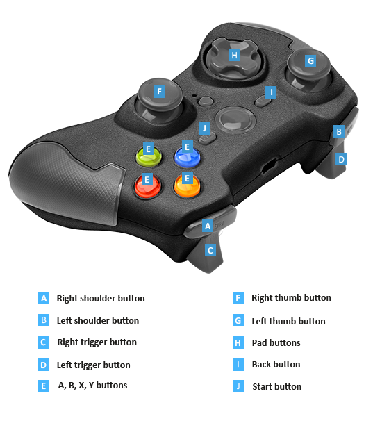

#Gamepads

<span class="label label-doc-level">Beginner</span>
<span class="label label-doc-audience">Programmer</span>

**Gamepads** are popular console input devices, e.g. Xbox Elite Wireless Controller and PS4 DualShock.
Some players use gamepads instead of usual keyboard/mouse even on desktop platforms.

Each **Gamepad** brand has unique buttons and features. Therefore, it's important to understand how to handle gamepad input and what limitations **Xenko** has with regards to different gamepad types.

##Check Gamepad Availability

Before you can handle gamepad input, it's important to check, whether a gamepad is available in the system.

```HasGamePad``` property of the ```Input``` base class returns a Boolean (true/false) value to indicate gamepad availability.

```GamePadCount``` property of the ```Input``` base class gets the number of gamepads connected to the system.

```IsConnected``` field of the ```GetGamePad(Int32)``` method of the ```Input``` base class is Boolean (true/false) value that indicates if a specific gamepad is connected.

> [!Note] 
> Currently Xenko does not support gamepad plugged at run-time. This feature will be added in the future releases.

##Gamepad Buttons

Below is an image of the Xbox Elite Wireless Controller. Let's use it to study how to handle **Gamepad Input** in your games:



_Xbox Gamepad_

1. Most gamepad controls are **Digital** buttons. They have only three states: _Pressed_, _Down_, _Released_.
2. Right and Left **Triggers** (**C** & **D**) are **Analog** buttons. A player can pull a gamepad Trigger to a different degree. Therefore, you have to get the precise pull-degree of the **Triggers** at every update.
3. Right and Left **Thumbs** of **Thumb Sticks** (**A** & **B**) combine functionality of **Analog** and **Digital** buttons. Here's how you can handle **Input** from **Thumbs**:

|User Input | How to handle input?|
|----|----|
|A player presses a stick like a button | Handle like input from a digital button with the usual three states (_Pressed_, _Down_, _Released_). |
|A player rotates a stick in some direction | Use **Thumb stick x-axis/y-axis value** to get a precise stick position at every update. |

## Handle Gamepad Input

### Digital Buttons

For **Digital buttons** as well as for instances when a player **Presses Thumb buttons**, use three methods of the ``Input`` base class:

| Method | Functionality |
|----|----|
| IsPadButtonDown(Int32, GamePadButton) | Checks whether the specified gamepad button is being pressed down. |
| IsPadButtonPressed(Int32, GamePadButton) | Checks whether the specified gamepad button was pressed since the previous update. |
| IsPadButtonReleased(Int32, GamePadButton) | Checks whether the specified gamepad button was released since the previous update. |

_Index (Int32)_: Specifies a gamepad you want to check.

_GamePadButton_: Specifies a button you want to check.

You can also get information on digital buttons with the ``Buttons`` field of the ```GetGamePad(Int32)``` method of the ```Input``` base class.

> [!Note] ``Buttons`` field is a bitmask that uses binary system.
> Depending on the bitmask value you can determine which buttons are _Up_ or _Down_.

### Analog Buttons

``GetGamePad(Int32)`` method of the Input base class handles **Analog Input** from **Triggers** and **Thumbs' Rotations**.

_Index (Int32)_: Specifies a gamepad you want to check.

Use the following fields of the ```GetGamePad(Int32)``` method to handle **Input** from a specific **Analog** button:

| Field | Description |
|----|----|
| LeftThumb | Left thumb stick x-axis/y-axis value in the range [-1.0f, 1.0f] for both axis. |
| LeftTrigger | Left trigger analog control value in the range [0, 1.0f] for a single axis. |
| RightThumb | Right thumb stick x-axis/y-axis value in the range [-1.0f, 1.0f] for both axis. |
| RightTrigger | Right trigger analog control value in the range [0, 1.0f] for a single axis. |

### Gamepad Vibration
```SetGamePadVibration(Int32, Single, Single)``` method of the Input base class sets vibration states for gamepads.

> [!Note] Currently, you cannot control gamepad vibration in Xenko.
> This feature will be added in the future releases.

##Gamepad Limitations

Currently, Xenko doesn't distinguish between **Gamepads** of different brands. Such approach implies certain limitations.
For instance, PS4 DualShock controller has a touchpad, but you can't use this touchpad as an **Input Source** in Xenko.
This issue will be addressed in the future releases of the Game Engine.

##Code Sample

```
public class TestScript : SyncScript
{
	public override void Update()
	{   
		//Check if a gamepad is available
		if (Input.HasGamePad)
		{
			//Get the number of gamepad plugged
			int gamepadCount = Input.GamePadCount;
			
			// Check the status of each gamepad
			for (int i = 0; i < gamepadCount; i++)
			{
				//Get analog sticks' position (Thumbs)
				Vector2 speed = Input.GetGamePad(i).LeftThumb;
				Vector2 direction = Input.GetGamePad(i).RightThumb;

				//Get status of digital buttons
				if (Input.IsPadButtonDown(i, GamePadButton.X))
				{
					// Do repetitive action here (for example: shoot)
				}
				if (Input.IsPadButtonPressed(i, GamePadButton.A))
				{
					// Do one-time action here (for example: use med-kit). 
					// This is triggered once only even if player holds that button down.
				}
			}
		}
	}
}
```

<div class="doc-relatedtopics">
* [Keyboard](keyboard.md)
* [Virtual Keys](virtual-keys.md)
</div>
