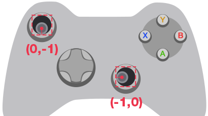
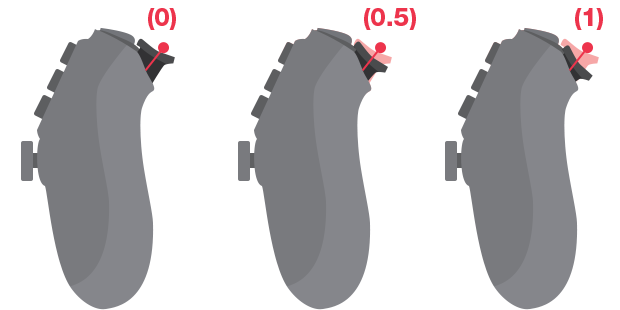

# Gamepads

<span class="label label-doc-level">Beginner</span>
<span class="label label-doc-audience">Programmer</span>

**Gamepads**, such as the Xbox Elite Wireless Controller and the PS4 DualShock, are popular input devices for consoles and desktop.

> [!Note] 
> Xenko is currently optimized for the Xbox Elite gamepad. Other controllers work, but might have unexpected button mappings. Gamepad-specific features like the PS4 DualShock touchpad will be supported in future releases.

## Digital and analog buttons

* **Digital** buttons have three states: _pressed_, _down_, and _released_.
The D-pad, Start, Back, Thumbstick (press), A, B, X and Y buttons are analog buttons.
* **Analog** buttons return a value depending on how hard the user presses. The triggers are analog buttons, and return a value between 0 and 1. The thumbsticks are also analog, and return values between -1 and 1 on the X and Y axes. 

The Xbox Elite controller buttons have the following names in Xenko:


## Handle gamepad input

### Check that gamepads are connected

Before handling gamepad input:

* Use [Input.HasGamePad](xref="SiliconStudio.Xenko.Input.InputManager.HasGamePad") to check if a gamepad is connected.
* Use [Input.GamePadCount](xref="SiliconStudio.Xenko.Input.InputManager.GamePadCount") to check how many gamepads are connected.
* Use [GamePadState.IsConnected](xref="SiliconStudio.Xenko.Input.GamePadState.IsConnected") to check if the current gamepad has been disconnected.

> [!Note] 
> Xenko doesn't support gamepads connected at runtime. This feature will be added in a future release.

### Digital buttons

Query the states and state changes of digital buttons with the following methods:

| Method | Functionality |
|----|----|
| [IsPadButtonDown(index, button)](xref="SiliconStudio.Xenko.Input.InputManager.IsPadButtonDown.System.Int32") | Checks whether the button is in the _down_ state. |
| [IsPadButtonPressed(index, button)](xref="SiliconStudio.Xenko.Input.InputManager.IsPadButtonPressed.System.Int32") | Checks whether the user has _pressed_ the button since the previous update. |
| [IsPadButtonReleased(index, button)](xref="SiliconStudio.Xenko.Input.InputManager.IsPadButtonReleased.System.Int32") | Checks whether the user has _released_ the button since the previous update. |

* _index (Integer)_: The index of the gamepad you want to check.
* _button (GamePadButton)_: The gamepad button you want to check.

You can also get the state of digital buttons using the [GamePadState.Buttons](xref="SiliconStudio.Xenko.Input.GamePadState.Buttons").

> [!Note] The ``Buttons`` field is a bitmask that uses binary system.
> Depending on the bitmask value, you can determine which buttons are _Up_ or _Down_.

### Analog buttons

To query values of analog buttons, first get the current state of gamepad using 
[GetGamePad(index)](xref="SiliconStudio.Xenko.Input.InputManager.GetGamePad.System.Int32"), where _index (Integer)_ is the index of the gamepad you want to check.

> [!WARNING]
> The value returned by `GetGamePad` is the state of the gamepad at the **current** update. You can't reuse this value for the next updates. You have to query it again in every update.

To get trigger and thumbstick positions, use these 
[GamePadState](xref="SiliconStudio.Xenko.Input.GamePadState") fields:

| Field | Description |
|----|----|
| [LeftThumb](xref="SiliconStudio.Xenko.Input.GamePadState.LeftThumb) | Left thumbstick X-axis/Y-axis value in the range [-1.0f, 1.0f] for both axes. |
| [RightThumb](xref="SiliconStudio.Xenko.Input.GamePadState.RightThumb) | Right thumbstick X-axis/Y-axis value in the range [-1.0f, 1.0f] for both axes. |
| [LeftTrigger](xref="SiliconStudio.Xenko.Input.GamePadState.LeftTrigger) | Left trigger analog control value in the range [0, 1.0f] for a single axes. |
| [RightTrigger](xref="SiliconStudio.Xenko.Input.GamePadState.RightTrigger) | Right trigger analog control value in the range [0, 1.0f] for a single axis. |

Thumbsticks move along the X and Y axes. Their positions read as follows:




Triggers move along the X axis. Their positions reads as follows:



### Vibration

To set the gamepad vibration level, use 
[SetGamePadVibration](xref="SiliconStudio.Xenko.Input.InputManager.SetGamePadVibration.System.Int32.System.Single.System.Single").

> [!Note] 
> Xenko only supports vibration for Xbox gamepads. Vibration support for other gamepads will be added in a future release.

## Example code

```
public class TestScript : SyncScript
{
	public override void Update()
	{   
		//Check if a gamepad is connected
		if (Input.HasGamePad)
		{
			//Get the number of connected gamepads
			int gamepadCount = Input.GamePadCount;
			
			// Check each gamepad's status
			for (int i = 0; i < gamepadCount; i++)
			{
				//Get the analog thumbstick positions
				Vector2 speed = Input.GetGamePad(i).LeftThumb;
				Vector2 direction = Input.GetGamePad(i).RightThumb;

				//Get the digital buttons' status
				if (Input.IsPadButtonDown(i, GamePadButton.X))
				{
					// The action repeats for as long as the user holds the button down.
					// This is useful for continuous actions such as firing a machine gun.
				}
				if (Input.IsPadButtonPressed(i, GamePadButton.A))
				{
					// The action is triggered only once, even if the user holds the button down.
					// This is useful for one-time actions such as jumping.
				}
			}
		}
	}
}
```
## See also
* [Input index](index.md)
* [Keyboards](keyboards.md)
* [Virtual buttons](virtual-buttons.md)