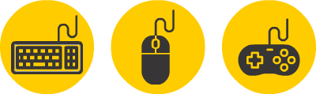
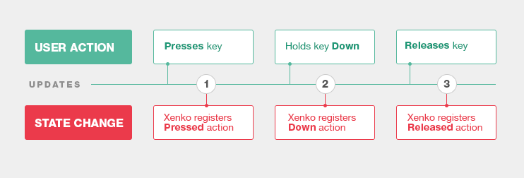
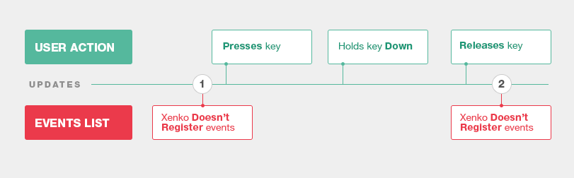

#Input

Beginner
Programmer

**Input devices** allow users to interact with games and applications.
Every interactive game should support at least one input device, otherwise it will be impossible to play.

Standard input devices are _Keyboard_, _Mouse_, _Gamepad_, _Pointers_, _Gestures_, and _Sensors_.
Xenko handles **Input** entirely via scripts.

Xenko provides two types of APIs:
* Low-level APIs are close to hardware, so they have latency.
These APIs allow fast processing of the Input from _Pointers_, _Keyboard_, _Mouse_, _Gamepads_, and some _Sensors_.
* High-level APIs interpret Input for you, so they have higher latency.
These APis are reserved for _Gestures_ and some _Sensors_.

## Overview
To check whether a particular input device is available,
use the corresponding property of the [Input](xref="SiliconStudio.Xenko.Input.InputManager") base class.
For instance, use [Input.HasMouse](xref="SiliconStudio.Xenko.Input.InputManager.HasMouse") to check if **Mouse** is connected.

> [!Note] 
> Currently Xenko does not support devices plugged at run-time. This feature will be added in the future releases.

After you check device availability, there are _Four_ ways to handle **Input** in Xenko.

###01: Query States
You can query the **State** of the _Keys_ and _Buttons_ in the last update.
For instance, [KeyDown](xref="SiliconStudio.Xenko.Input.InputManager.KeyDown") gets a list of the keys that were _Down_ in the last update.

Here's how you should handle input from various devices:

**1) For Gamepad digital buttons and Keyboard**: query which keys and buttons are _Down_.

> [!Note] Sometimes a user performs several actions between two updates.
> If in total there was no state change between two updates, Xenko won't register any actions:

**2) For Gamepad analog buttons (thumbs and triggers)**: query _Position_ values:

> [!Note] If there's no position change between two updates, Xenko won't register position change.

**3) For Sensors**: query _Float_ or _Vector_ values.

###02: Query State Change
You can query the **Change of State** of the _Buttons_ and _Keys_ since the previous update.
In this case, you don't get the list of all buttons and keys, but have to query each Button and Key separately.

Here's how you should handle input from various devices:

**1) For Gamepad digital buttons, Keyboard, and Mouse buttons**: query if the button or key was _Pressed_, _Down_ or _Released_ in the last update.

> [!Note] Sometimes a user performs several actions between two updates.
> If in total there was no state change between two updates, Xenko won't register any actions:

**2) For Mouse Position and Mouse Wheel Scrolling**: query _Delta Values_ since the previous update:

> [!Note] If there's no mouse wheel position change between two updates, Xenko registers Zero Delta Value.

###03: Query List of Events
For _Pointers_, _Gestures_, and _Keyboard_, you can query the **List of Events** that happened in the last update.

> [!Note] Sometimes a user performs several actions between two updates.
> If in total there was no state change between two updates, Xenko won't register any events:

###04: Use Virtual Buttons
You can use **Virtual Buttons**, so the **Input** is not tied to physical buttons and keys.
Associate keys to actions, and write your gameplay based on those actions rather than physical keys.

Fore more info read [Vritual Buttons](virtual-buttons.md).

##Available Input APIs
* [Gamepads](gamepads.md): Low-level API lets you control buttons and analog sticks of the XBox-like gamepads.
* [Gestures](gestures.md): High-level API interprets predefined patterns of finger touches.
* [Keyboard](keyboard.md): Low-level API allows you to query the state of keys and control keyboard input.
* [Mouse](mouse.md): Low-level API lets you query the state of mouse buttons, input from mouse wheel scroll and additional mouse buttons.
* [Pointers](pointers.md): Low-level API for mobile devices allows to read finger touches.
* [Sensors](sensors.md): Special API that interprets input from the sensors of the mobile devices.
* [Virtual Buttons](virtual-buttons.md): Special API helps you build games and applications around user actions rather than particular physical keys and buttons.
