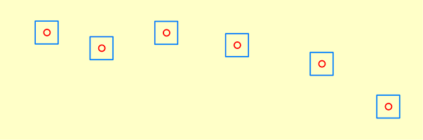
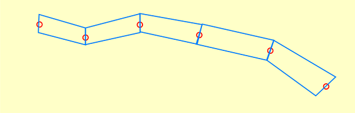
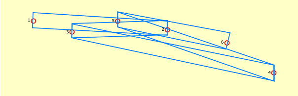
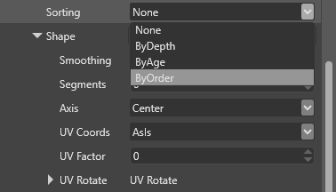
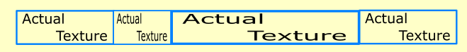
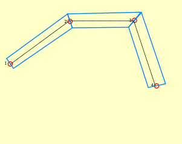
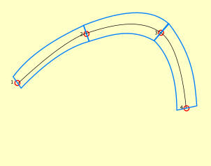
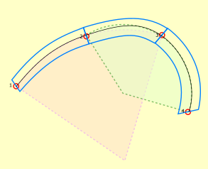

# Ribbons and trails

**Ribbons and trails** are particle shape builders which build the mesh data as a strip connecting all particles, rather than individual quads.

In this diagram, several particles (represented as red dots) are rendered as individual quads (blue rectangles):

In this diagram, the same particles are rendered by connecting them to each other and rendering the quad between the adjacent particles. This appears as a continuous strip or "ribbon".

To change the shape go to *Shape* and choose either *Ribbon* or *Trail*. They are both displayed as connected strips of quads, but the ribbon will try to render the strip facing the camera as much as possible. The trail on the other hand will display the strip fixed in 3D space, but it requires one additional attribute, Direction. With both the particle's position and direction a completely defined 3D surface can be built.

## Order particles

If you switched from a billboard shape to a ribbon or a trails you may experience the following problem. 

Rather than connecting the particles in order, the strip erratically jumps between particles, seemingly at random. This is the same problem alpha-blended quads have when they are not properly sorted. To fix this, we need to sort the particles.

To sort the particles, under **Particle System > Source > Emitters**, change the **Sorting** property.

To create trail and ribbon effects, you usually sort the particles by **age** or **spawn order** (the order in which they are emitted).

If your particles have the same **lifespan** property, and you emit no more than one particle per frame (at 30 or less particles per second that's usually the case), you can sort them by age.

However, if you spawn several particles per second or your particles vary in lifespan, sorting by age doesn't provide a consistent order, as the sorting parameter changes between frames.

In such cases you want to sort the particles by order. Order is an new particle attribute, but it's not included by default. Adding a new Initializer, *Spawn Order*, add the required attribute to the particle system and the particles can now be sorted by order.

Sorting by depth might work in niche cases, but this doesn't preserve the order between different frames. We don't recommend it for most situations.

## Ribbons vs trails

Both ribbons and trails generate a flat surface which follows an axis connecting adjacent particles in a line. This line defines one of the axes of the surface.

The difference between ribbons and trails is in the second axis used to build the shape. In case of ribbons, the second axis is positioned in camera space, facing the ribbon towards the camera at all times. This gives the illusion of volume to the ribbon, but the shape is not stable in 3D, as it changes when the camera moves.

Trails read an extra attribute, **Direction**, from the particle data and use it as a second axis for the surface. This **fixes the surface in 3D space**, so trails don't change with the camera position. 

The image below shows the different behavior of ribbons (red) and trails (yellow) when viewed from different camera angles. Note how the ribbon doesn't change as the camera moves.

## Texture coordinates

Unlike billboards, which are individual quads, ribbons and trails have a single surface across all particles. To define how textures are mapped across the surface, under **Particle System > Source > Emitters > Shape**, change the **UV Coords** property.

 - **AsIs**: The texture is mapped per segment, essentially copying the same quad stretched between every two particles. This is sometimes useful when combined with flipbook animations (in the Material settings).

    
 
 - **Stretched** - the texture is stretched between the first and last particle of the trail or ribbon. The **UV Factor** property defines how many times the texture appears across the entire trail or ribbon (1 = once).

     

 - **DistanceBased** - the texture is repeated based on the actual world length of the ribbon or trail rather than the number of particles. The attribute **UV Factor** defines the distance in meters after which the texture repeats, with 1 indicating a repeat step of 1 meter.

     

## Smooth ribbons and trails

You can add extra segments between adjacent particles to smooth the lines between particles. To do this, under **Particle System > Source > Emitters > Shape**, change the **Smoothing** property.

 * **None** - No smoothing means there is only one segment joining two particles. Sharp angles along the central axis are apparent.

    
 
 * **Fast** - This uses [Catmull-Rom interpolation (Wikipedia)](https://en.wikipedia.org/wiki/Centripetal_Catmull%E2%80%93Rom_spline) to add control points between particles. You can set the number of segments between every two particles with the **Segments** property.

     
 
 * **Best** - This matches a circumcircle around every three sequential particles along the control axis and then adds extra control points on the circle, keeping the segments in an arc. For the first and the last segment there is only one arc to be followed, but for mid-sections there are two different arcs from two different circles. In this case, the control points are interpolated from the first arc to the second, as the point approaches the second particle. The Best setting generally creates the smoothest effect, but requires more CPU. You can set the number of segments between every two particles with the **Segments** property.

    

This video shows the difference between the smoothing methods (left: none, center: fast, right: best).

You can check the **Ribbon Particles Sample** if you need a quick look at a project which already uses ribbons and trails.