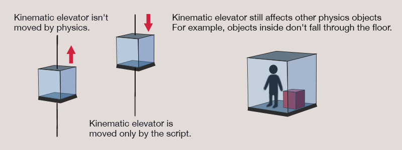
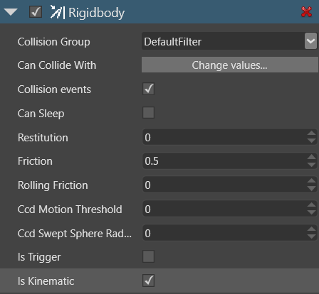

# Kinematic rigid bodies

Sometimes you want to move [rigid bodies](rigid-bodies.md) in a specific way rather than have other objects move them. For example, you might control an elevator with a script, via its `Transform` property, rather than have other objects push and pull it. This is a **kinematic** rigid body.

Although kinematic rigid bodies aren't moved by physics, other objects can still collide with them. For example, in the case of the elevator, objects placed inside won't fall through the elevator floor.

## Make a kinematic rigid body

1. Select the entity you want to be a kinematic rigid body.

2. In the **property grid**, under the **Rigidbody** component properties, select **Is kinematic**.

    

## Scripting kinematic rigid bodies

You can script the **Is kinematic** property to turn on and off on certain events. For example, imagine our kinematic elevator's suspension cables are cut. You can script the **Is kinematic** property to change to *false* when this happens. The elevator becomes subject to the usual forces of physics, and falls.

## See also

* [Rigid bodies](rigid-bodies.md)
* [Static colliders](static-colliders.md)
* [Characters](characters.md)
* [Collider shapes](collider-shapes.md)
* [Triggers](triggers.md)