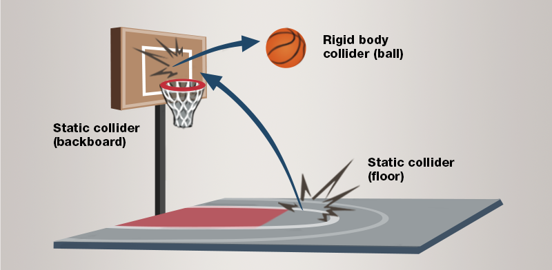

# Rigid bodies

Beginner
Designer

**Rigid bodies** move based on physical forces applied to them, such gravity and collisions.
Typical rigid bodies are boxes, balls, furniture, and so on — objects that are pushed, pulled, and knocked around, and also have effects on other rigid bodies they collide with.

## Kinematic rigid bodies

Sometimes you want to move rigid bodies in a specific way rather than have other objects move them.
For example, you might control an elevator with a script, via its Transform property, rather than have other objects push and pull it.
This is a **kinematic** rigid body.

Although kinematic rigid bodies aren't moved by physics, other objects can still collide with them.
In the case of the elevator, for example, objects placed inside won't fall through the elevator floor.

To make a rigid body kinematic, in the **Property grid**, under the **Rigidbody** component properties, select **Is kinematic**.

### Scripting kinematic rigid bodies
You can script the **Is kinematic** property to turn on and off on certain events.
For example, imagine our kinematic elevator's suspension cables are cut.
You can script the **is kinematic** property to change to _false_ when this happens.
The elevator becomes subject to the usual forces of physics, and falls.

## Component properties

You can adjust the properties of each component in the **Property grid**.

Property              | Description
----------------------|-----------------------
Collision Group       | Sets which collision group the object belongs to.
Can Collide With      | Sets which groups the object collides with.
Collision Events      | If this is enabled, the object reports collision events, which you can use in scripts. It has no effect on physics. If you have no scripts using collision events for the object, disable this option to save CPU.
Can Sleep             | If this is enabled, the physics engine doesn't process physics objects when they're not moving. This saves CPU.
Restitution           | Sets the amount of kinetic energy lost or gained after a collision. A typical value is between 0 and 1. If the restitution property of colliding entities is 0, the entities lose all energy and stop moving immediately on impact. If the restitution is 1, they lose no energy and rebound with the same velocity they collided at. Use this to change the "bounciness" of rigid bodies.
Friction              | Sets the surface friction.
Rolling Friction      | Sets the rolling friction.
CCD Motion Threshold  | Sets the velocity at which continuous collision detection (CCD) takes over. CCD prevents fast-moving entities (such as bullets) erroneously passing through other entities.
CCD Swept Sphere Radius | Sets the radius of the bounding sphere containing the position between two physics frames during continuous collision detection.
Is Trigger            | Toggles whether the rigid body is a [trigger](triggers.md).
Is Kinematic          | Toggles whether the rigid body is kinematic and therefore moved only by its Transform property.
Mass                  | Sets the collider mass. For large differences, use a point value; for example, write *0.1* or *10*, not *1* or *100000*.
Linear damping        | The amount of damping for directional forces.
Angular damping       | The amount of damping for rotational forces.
Gravity               | Sets a custom gravity vector applied if Override Gravity is selected.
Override Gravity      | Overrides gravity with the vector specified in Override Gravity.
Node Name             | If the collider entity contains a bone structure, the node name can refer to a bones node name to be linked to that specific bone.
Collider Shapes       | Adds a [collider shape](collider-shapes.md).

## See also
* [Collider shapes](collider-shapes.md)
* [Simulation](simulation.md)
* [Physics tutorials](tutorials/index.md)