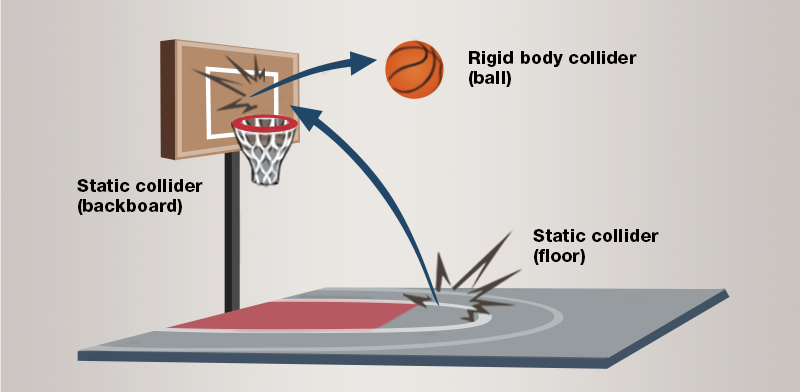

# Static colliders

<span class="label label-doc-level">Beginner</span>
<span class="label label-doc-audience">Designer</span>

**Static colliders** aren't moved by forces such as gravity and collisions, but other physics objects can bump into them.
Typical static colliders are strong immovable objects like walls, floors, large rocks, and so on.



## Component properties

You can adjust the static collider properties in the **Property grid**.

Property              |   Description
----------------------|-----------------------
Collision Group       | Sets which collision group the object belongs to.
Can Collide With      | Sets which groups the object collides with.
Collision Events      | If this is enabled, the object reports collision events, which you can use in scripts. It has no effect on physics. If you have no scripts using collision events for the object, disable this option to save CPU.
Can Sleep             | If this is enabled, the physics engine doesn't process physics objects when they're not moving. This saves CPU.
Restitution           | Sets the amount of kinetic energy lost or gained after a collision. A typical value is between 0 and 1. If the restitution property of colliding entities is 0, the entities lose all energy and stop moving immediately on impact. If the restitution is 1, they lose no energy and rebound with the same velocity they collided at. Use this to change the "bounciness" of rigid bodies.
Friction              | Sets the surface friction.
Rolling Friction      | Sets the rolling friction.
CCD Motion Threshold  | Sets the velocity at which continuous collision detection (CCD) takes over. CCD prevents fast-moving entities (such as bullets) erroneously passing through other entities.
CCD Swept Sphere Radius | Sets the radius of the bounding sphere containing the position between two physics frames during continuous collision detection.
Is Trigger            | Toggles whether the static collider is a [trigger](triggers.md)

## Move a static collider at runtime

If you need to move a static collider at runtime, you can do it with a script:

```
PhysicsComponent.Entity.Transform.Position += PhysicsComponent.Entity.Transform.Position + Vector3.UnitX;
PhysicsComponent.Entity.Transform.UpdateWorldMatrix();
PhysicsComponent.UpdatePhysicsTransformation();
```

## See also

* [Rigid bodies](rigid-bodies.md)
* [Characters](characters.md)
* [Collider shapes](collider-shapes.md)
* [Triggers](triggers.md)