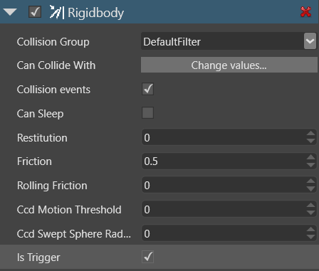

# Triggers

Beginner
Designer

If you set a rigid body collider to be a **trigger**, other colliders no longer bump into it, but pass through.
The trigger detects when objects go through, which you can use to script events.

For example, you can detect when a player character enters a room, and use this in your script to trigger an event.

Only a **rigid body** can be a trigger.
To make it a trigger, in the **Property grid**, under the component properties, select **Is Trigger**.

For an example of how to use triggers, see the [Script a trigger](script-a-trigger.md) tutorial.