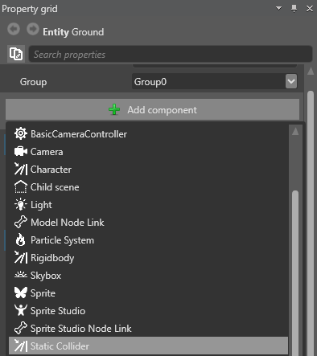
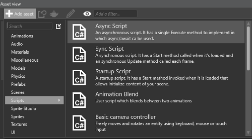

# Create a trigger

<div class="doc-incomplete"/>

**Triggers** are [static colliders](static-colliders.md) that detect collision, but don't affect the objects they collide with.
When a static collider is a trigger, objects no longer bump into them.
Instead they pass through, triggering an event which you can detect in your code.
For example, you can use a trigger to detect when a player character enters ("collides" with) a room, and use this in your script to begin a new event.

## 1. Add the trigger component

Follow the instructions in the [Create a bouncing ball](create-a-bouncing-ball.md) tutorial.
This gives us a simple scene in which a ball falls from mid-air, hits the ground, and bounces.


Now we'll add a trigger in the space between the ball and the ground.

1. In the **Scene editor**, click the white plus sign (**Create new entity**) and select **Empty entity**.
Game Studio adds an entity to the scene with the default name **Entity**.

    

2. Rename the entity _Trigger_.

3. With the Trigger entity selected, in the **Property grid**, click **Add component** and select **Static Collider**.

    

4. In the **Property grid**, expand the **Static Collider component** to view its properties.

5. Select the **Is Trigger** checkbox. This means that objects can pass through the entity.

    

6. We need to give the trigger a shape. Next to **Collider Shapes**, click the **green plus icon** and select **Box**.

    

7. Let's make the trigger a larger area. Under **Transform**, set the **scale** to: _X:2, Y:2, Z:2_

    

8. Right now, the trigger is in the same position as the ground.
    
    

    We need to move it between the ground and the sphere. 
    With the entity selected, in the **Property grid**, under **Transform**, set the **Position** to: _X:0, Y:3, Z:0_

    

## 2. Handle the trigger event with script

If we run the project now (**F5**), the ball falls through the trigger, but nothing happens.


Let's write a script to make something happen when the entity enters the trigger.

1. In the **Asset view**, click **Add asset** and select **Scripts** > **Async Script**.

    

2. In the **Script wizard** dialog, give the name a script (eg _Trigger_) and click **OK**.

    * If Game Studio asks you to save your script, click **Yes**. 
    * If Game Studio asks to reload the assemblies, click **Yes**.

        

3. Open the script, add the following code, and save it:

    ```
    using SiliconStudio.Xenko.Engine;
    using SiliconStudio.Xenko.Physics;
    using System.Threading.Tasks;
    using SiliconStudio.Core.Mathematics;

    namespace VolumeTrigger
    {
        public class Trigger : AsyncScript
        {
            public override async Task Execute()
            {
                var trigger = Entity.Get<PhysicsComponent>();
                trigger.ProcessCollisions = true;

                // Start state machine
                while (Game.IsRunning)
                {
                    // 1. Wait for an entity to collide with the trigger
                    var firstCollision = await trigger.NewCollision();

                    var otherCollider = trigger == firstCollision.ColliderA
                        ? firstCollision.ColliderB
                        : firstCollision.ColliderA;
                    otherCollider.Entity.Transform.Scale = new Vector3(2.0f, 2.0f, 2.0f);

                    // 2. Wait for the entity to exit the trigger
                    Collision collision;

                    do
                    {
                        collision = await trigger.CollisionEnded();
                    }
                    while (collision != firstCollision);

                    otherCollider.Entity.Transform.Scale= new Vector3(1.0f, 1.0f, 1.0f);
                }
            }
        }
    }
    ```

    This code doubles the size (scale) of any entity that enters the trigger.
    When the entity exits the trigger, it returns to its original size.

4. Add the Trigger script component to the trigger entity. To do this, with the Trigger entity selected, in the **Property grid**, click **Add component** and select the **Trigger** script.

    

5. Run the project (**F5**) to see the trigger in action. The ball falls through the trigger, doubles in size, exits the trigger, and returns to its normal size.

     
