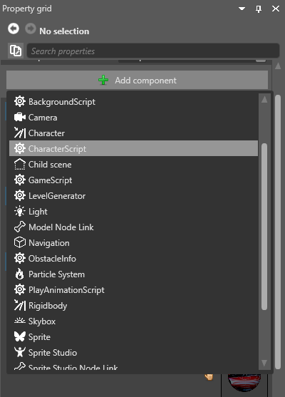

# Add a script

<span class="label label-doc-level">Beginner</span>
<span class="label label-doc-audience">Programmer</span>

To use a script, add it to an entity as a component. You can do this in Game Studio or in code. Xenko runs scripts when the entity they are attached to is loaded.

You can add a single script to as many entities as you need. You can also add multiple scripts to single entities; in this case, Xenko creates multiple instances of the script. This means the same script can have different values in its [public properties and fields](public-properties-and-fields.md).

## Add a script in Game Studio

There are two ways to add scripts to entities in Game Studio: 

* drag the script from the asset view to the entity properties
* add the script in the property grid

### Drag and drop

1. In the **entity tree** (on the left by default), or in the scene, select the entity you want to add the script to.

2. In the **solution explorer** (in the bottom left by default), select the assembly which contains your script. Game Studio shows your script in the **asset view**.

    >[!Note]
    >Though scripts are a kind of asset, they're not saved in the Assets folder. Instead, they're saved in your .Game folder. For more information, see [Project structure](../files-and-folders/project-structure.md).

3. Drag the script from the **asset view** to the **property grid**.
   
   Game Studio adds the script to the entity.

### Add the script in the property grid

1. In the scene editor, select the entity you want to add the script to.

    

2. In the **property grid** (on the right by default), click **Add component** and select the script you want to add.

    

    Game Studio adds the script to the entity.

## Add a script from code

The code below adds a script to an entity.

    ```cs
    // myEntity is an existing entity in the scene; myAsyncScript is the script you want to add to the entity
    myEntity.Add(new myAsyncScript());
    ``` 

## See also

* [Types of script](types-of-script.md)
* [Create a script](create-a-script.md)
* [Public properties and fields](public-properties-and-fields.md)
* [Scheduling and priorities](scheduling-and-priorities.md)
* [Events](events.md)
* [Debugging](debugging.md)
* [Preprocessor variables](preprocessor-variables.md)