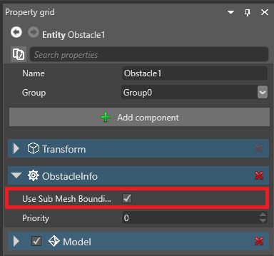
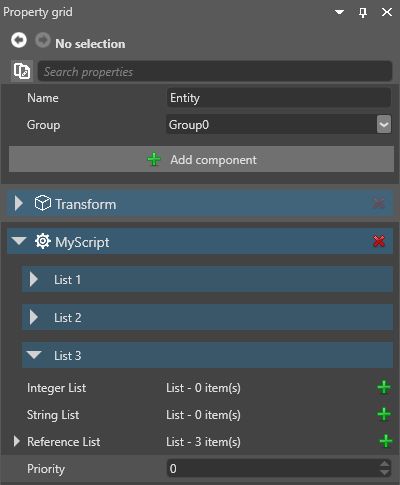

# Public properties and fields

<span class="label label-doc-level">Beginner</span>
<span class="label label-doc-audience">Programmer</span>

When you declare a public property or field in a script, the property becomes accessible in Game Studio from the script component properties.



You can attach the same script to multiple entities and set different property values on each entity.

> [!Note] 
> Public properties or fields must be serializable to be used in Game Studio. 

## Add a public property or field

This script has a public property (`DelayTimeOut`):

```cs
public class SampleSyncScript : StartupScript
{
	// This public member will appear in Game Studio
	public float DelayTimeOut { get; set; }
}
```

Game Studio shows the `DelayTimeOut` property in the script component properties:


>[!Note]
>As a general rule, if you want to display the property or field in Game Studio, getters and setters should do as little as possible. For example, they shouldn't try to call methods or access Xenko runtime API.

>The following code will create problems, as it tries to access `Entity.Components`, which is only available at runtime:

>```cs
>public class SampleSyncScript : StartupScript
>{
>	private float delayTimeOut;
>	// This public member will appear in Game Studio
>	public float DelayTimeOut
>	{
>		get { return delayTimeOut; }
>		set
>		{ 
>			delayTimeOut = value;
>			Entity.Components.Add(new SkyboxComponent());
>		}
>	}
>}
>```
>If you want to include code like this in a property or field, hide it so Game Studio doesn't display it (see below). 

## Attributes

When you declare public properties and fields, you can include attributes to change how users edit them in the Game Studio property grid. 

Add attributes above public classes you declare in your scripts. For example:

```cs
        [DataMember]
        [DataMemberRange(-10, 10, 0.1f, 1f)]
        [Display(category: "Simple Properties")]
        [DefaultValue(2.0f)]
        public float Float { get; set; } = 2.0f;
```

### DataMember

[DataMember](https://msdn.microsoft.com/en-us/library/system.runtime.serialization.datamemberattribute) 

### DataMemberRange

[DataMemberRange](xref:SiliconStudio.Core.Annotations.DataMemberRangeAttribute) specifies the range of the value you can set in the property grid.

```cs
        [DataMember]
        [DataMemberRange(-10, 10, 1, 2)]
        public int Integer { get; set; }
```

* The first number specifies the minimum value.
* The second number specifies the maximum value.
* The third number specifies the increments the value increases and decreases by.
* **The fourth number is a mystery. Good luck!**

### DataMemberIgnore

[DataMemberIgnore](xref:SiliconStudio.Core.DataMemberIgnoreAttribute) hides the property in the property grid. 

```cs
	// This public property isn't available in Game Studio
	[DataMemberIgnore]
	public float DelayTimeOut { get; set; }
```	

Game Studio no longer shows the property in the property grid:

![Public property been hidden with ```[DataMemberIgnore]```](media/scripts-in-xenko-public-property-with-datamemberignore.png)

### DefaultValue

[Default value](https://msdn.microsoft.com/en-us/library/system.componentmodel.defaultvalueattribute) sets a default value for the property.

>![Note]
>You need to specify this in both the ``DefaultValue`` attribute and after the class  declaration.

```cs
        [DefaultValue(2.0f)]
        public float Float { get; set; } = 2.0f;
```

### Display

[Class DisplayAttribute](xref:SiliconStudio.Core.DisplayAttribute) changes the property label in the property grid.

```cs
        [Display("My Property")]
        public double Double { get; set; }
```


You can also specify an expandable category for the property to be displayed under.

```cs
        [Display("My Property", "My Category")]
        public double Double { get; set; }
```


If you want to include the property in a category without giving it a name, use ``[Display(category: "My Category")]``. For example:

```cs
        [Display(category: "My Category")]
        public double Double { get; set; }
```

### CategoryOrder

By default, the property grid lists properties in the same order they appear in your script. You can specify a different order using [CategoryOrder](xref:SiliconStudio.Core.Annotations.CategoryOrderAttribute). 

Categories with lower numbers are displayed first. You can also use negative numbers.

```cs
    [CategoryOrder(1, "List 1")]
    [CategoryOrder(2, "List 2")]
    [CategoryOrder(3, "List 3")]
    public class MyScript : StartupScript
```



If two categories have the same number, the property grid lists them in alphabetical order. 

### MemberCollection

[MemberCollection](xref:SiliconStudio.Core.Annotations.MemberCollectionAttribute) changes how users can interact with items in a list.

```cs
        [DataMember]
        [MemberCollection(ReadOnly = false, NotNullItems = true, CanReorderItems = true)]
        [Display(category: "List 2")]
        public List<int> ReadonlyIntegerList { get; set; } = new List<int> { 0, 1, 2, 3, 4 };
```

| Property        | Description                                                                                     |
|-----------------|-------------------------------------------------------------------------------------------------|
| CanReorderItems | If `true`, you can re-order items in a list in the property grid by dragging and dropping them. |
| NotNullItems    | If `true`, items in the list can't be null.                                                     |
| ReadOnly        | If `true`, you can't add or remove items to or from a list in the property grid.                |

## See also

* [Types of script](types-of-script.md)
* [Create a script](create-a-script.md)
* [Add a script](add-a-script.md)
* [Scheduling and priorities](scheduling-and-priorities.md)
* [Events](events.md)
* [Debugging](debugging.md)
* [Preprocessor variables](preprocessor-variables.md)