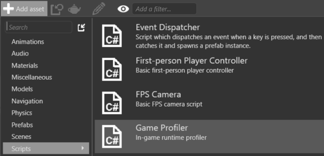
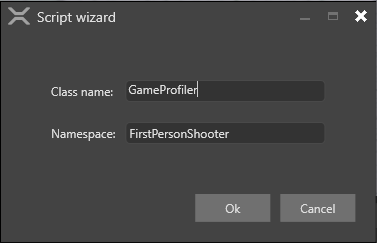
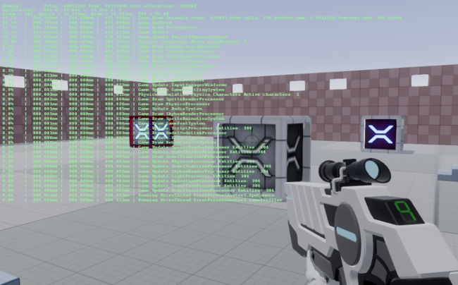
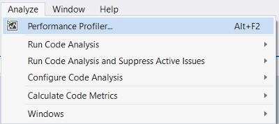

## Profiling

Beginner
Programmer

You can **profile** your project to check its runtime performance and find problems. You can use the Xenko profiler or an external profiling tool such as the Performance Profiler in Visual Studio.

## Profile with Xenko

The Xenko profiler shows how performance costs change at runtime. This will help you isolate the bottlenecks and find their root cause.

You can profile your project by adding a script to your scene.

1. In the **asset view**, click  and select **Scripts > Game Profiler**.

 

2. The **script wizard** opens. Leave the default information.

    

    Game Studio adds the GameProfiler script to your project.

3. If Game Studio asks you to save the script, click **Yes**.

4. If Game Studio asks to reload the assemblies, click **Yes**.

5. In the **scene view**, select an entity. It doesn't matter which entity you use.

6. In the **property grid**, click **Add component** and choose **GameProfiler**. (This is the script you added in steps 1 and 2.)

    

    Game Studio attaches the GameProfiler script to the entity as a component.

7. Build your project and run the application.

8. At runtime, press **Left Ctrl + Left Shift + P** to launch the profiler.

    

    >[!Note]
    >You can change the type of data the profiler displays. For more information, see the [Xenko profiler API documentation](xref:SiliconStudio.Core.Diagnostics.Profiler).

## Use external profiling tools

You can use external profiling tools to profile your project.

| Profiler | Type | Platforms |
| ---- | ---- | -----|
| [Visual Studio profiler](https://msdn.microsoft.com/en-us/library/mt210448.aspx) | Visual Studio feature | Desktop and mobile |
| [Xamarin Profiler](https://www.xamarin.com/profiler) | Standalone tool distributed with Xamarin Studio | Mobile |
| [RenderDoc](https://renderdoc.org/builds) | Standalone | Desktop and mobile |

### Use the Visual Studio profiler
Visual Studio has powerful in-built profiling tools that can identify common performance issues.

1. In Visual Studio, open your project solution (`.sln`) file.

2. To open the profiler, press **Alt + F2**, or in the task bar click **Analyze > Performance Profiler**.

    

3. In the **Profiler** window, select the profiling tools you want to run.

    

    You can run multiple profiling tools at once.

4. To launch the profiler, in the Performance Profiler tab, at the bottom, click **Start**. 
   
   
    
    Visual Studio runs your application and begins profiling.

For more information about the Visual Studio profiler, see the [MSDN documentation](https://msdn.microsoft.com/en-us/library/mt210448.aspx).

## Common bottlenecks

As CPU and GPU process different types of data, it's usually easy to identify which part is causing a bottleneck.

Most GPU problems arise when the application uses expensive rendering techniques, such as post effects, lighting, shadows, and tessellation. To identify the problem, disable rendering features. 

If instead there seems to be a CPU bottleneck, reduce the complexity of the scene.

For graphics:

* Decrease the resolution of your game.
* Reduce the quality of your post effects.
* Reduce the number of lights and size of shadow maps.
* Reduce shadow map sizes.
* Use culling techniques to reduce the number of objects and vertices rendered.

For textures:

* Use compressed textures on slower devices.
* Use sprite sheets, not individual images.
* Use texture atlases, not separate textures.