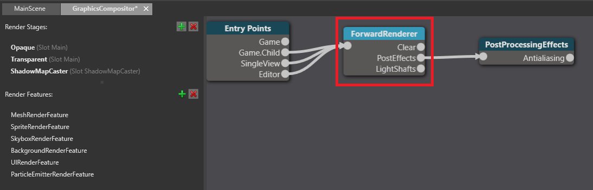
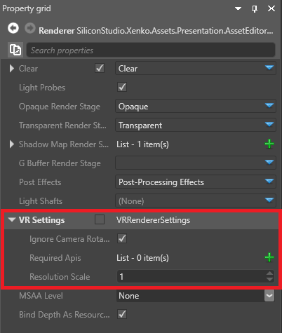
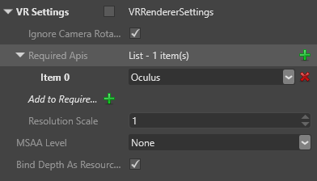
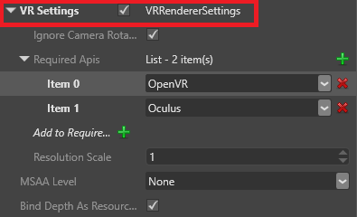
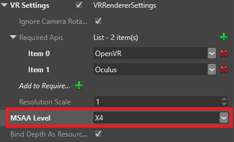

# Enable VR

Beginner
Programmer

This page explains how to add support for the Oculus Rift and Vive devices to your game. Future versions of Xenko will support other devices.

1. In the **asset view** (in the bottom pane by default), double-click the **Graphics Compositor**.

    

    The Graphics Compositor editor opens.

2. In the Graphics Compositor, select the **forward renderer** node.

    

3. In the **property grid** (on the right by default), expand **VR Settings**.

    

4. Next to **Required APIs**, click  (**Add a new item to the list**) (**Add a new item to the list**).

    Game Studio adds a new API to the list.

    

5. From the **Item** drop-down menu, select a VR API you want your game to support.

    

    | API    | Description 
    |--------|  --------
    | Oculus | Supports Oculus Rift devices (best support for Oculus Rift) 
    | OpenVR | Supports Vive and Oculus Rift devices (best support for Vive) 
    | Dummy  | Displays the game on the screen with two "eye cameras", instead of in the VR device (mainly useful for development). To display the dummy view in the Game Studio scene editor, make sure the editor is connected to the forward renderer.

6. Repeat steps 4 and 5 to add as many APIs as you need.

7. Make sure the list order is correct. When your game runs, it attempts to use the devices in the list order. For example, if the first item is Dummy, the game uses no VR device. If the last item is Dummy, the game only uses it if there is no VR device available.

    To change the order, change the selected VR device in each item.

    >[!Tip]
    >Although the OpenVR API supports both Vive and Oculus Rift devices, the Oculus API provides better support for Oculus Rift. For this reason, we recommend the following list order:
    >
    >* Item 0: Oculus
    >
    >* Item 1: OpenVR
    >
    >This means your game uses the Oculus API if an Oculus Rift device is connected, and the OpenVR API if another device (eg a Vive) is connected.

8. Enable **VRRendererSettings**.

    

Your game is now ready to use VR.

>[!Note]
>After you change APIs, you need to reload the project (**File > Reload project**) for the change to take effect at runtime. This is a known issue and will be fixed in a future release.

## VR properties

| Property                | Description      
|-------------------------|--------
| Ignore camera rotation  | Disables camera movement from inputs other than VR devices, helping to reduce [VR sickness](vr-sickness.md)   
| Resolution scale        | The resolution of the image displayed in the VR device. Higher resolutions produce better images, but require more CPU

## Multisample anti-aliasing 

As aliasing artifacts are more obvious in VR, we recommend you enable **MSAA** (multisample anti-aliasing) in the forward renderer properties (above the VR settings).

## See also

* [VR sickness](vr-sickness.md)
* [Graphics compositor](../graphics/graphics-compositor/index.md)