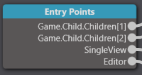
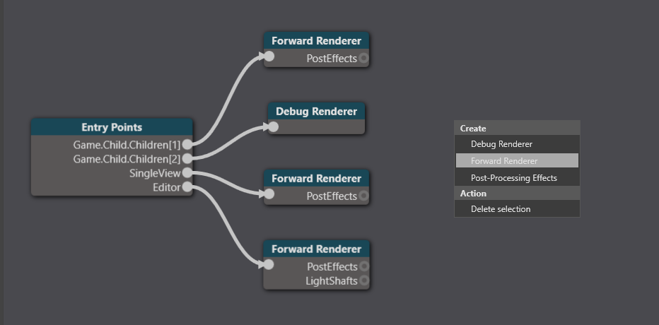

# Preview a scene in VR

To preview your scene in VR, [enable VR](enable-vr.md) on the forward renderer the editor is connected to.

>![Note]
>The graphics compositor screenshots on this page might differ from your Game Studio, depending on your graphics compositor setup.

1. In the **asset view** (in the bottom pane by default), double-click the **Graphics Compositor**.

    

    The graphics compositor editor opens.

    

2. Select the **Entry points** node.

    

3. In the **property grid**, next to **Editor renderer**, select the forward renderer you use to run your game in VR.

    > [!Note]
    > Make sure the forward renderer has VR enabled. For instructions, see [Enable VR](enable-vr.md).

This sends the scene editor output to your VR device, so you can preview the scene in your VR before you run the game.

## Alternative: create a toggle

This option creates an additional forward renderer you can use to switch between previewing scenes in VR and on your monitor.

1. In the **asset view** (in the bottom pane by default), double-click the **Graphics Compositor**.

    

    The graphics compositor editor opens.

    

2. Create a new forward renderer node. To do this, right-click the game compositor editor and select **Create > Forward renderer**.

    

3. Select the **Entry points** node.

    

4. In the **property grid**, next to **Editor renderer**, select the forward renderer you created.

    

5. Set the properties of the new forward renderer so they're identical to the forward renderer you use to run the game in VR, including the VR settings.

    > [!Tip]
    > You can right-click a property to copy or paste it.
    > 

    > [!Note]
    > Make sure the forward renderer has VR enabled. For instructions, see [Enable VR](enable-vr.md).

Xenko displays the scene preview in your VR device. To display the scene on your monitor instead, disable **VRRendererSettings** in the properties of the new forward renderer.

## See also

* [Enable VR](enable-vr.md)
* [Graphics compositor](../graphics/graphics-compositor/index.md)